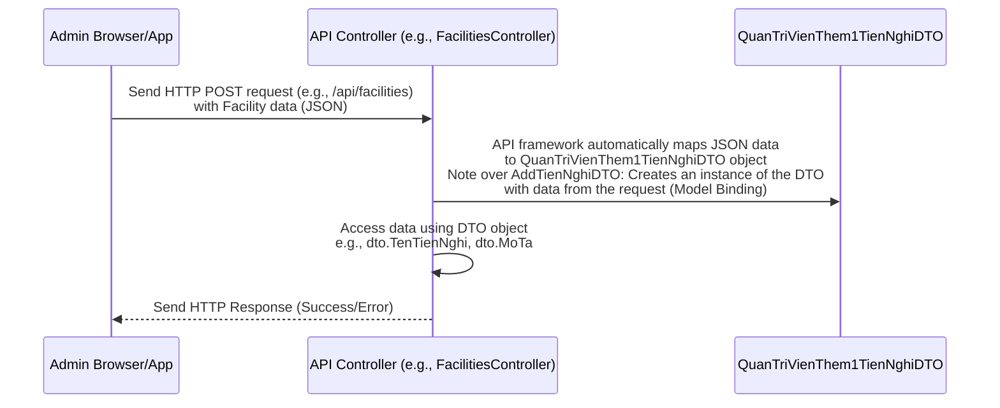

# Chapter 1: Data Transfer Objects (DTOs)

Welcome to the first chapter of the HotelManagementAPI tutorial!

In any application, especially one with different parts talking to each other (like a website or mobile app talking to our API), we need a clear way to define *what* information is being exchanged. Imagine you're sending a package – you need a standard envelope or box, and maybe a form inside specifying the contents.

In the world of APIs and software development, we use something similar called **Data Transfer Objects**, or **DTOs** for short.

Think of DTOs as **standardized forms or containers** used specifically for sending data between different parts of our application, or between our API and the "outside world" (like a user's web browser or phone app).

## Why Do We Need DTOs?

Let's consider a simple task in our Hotel Management API: an administrator wants to add a new amenity (like "Free Wi-Fi" or "Swimming Pool") to the hotel system.

The administrator would likely fill out some details, like the name of the amenity and maybe a short description, on an admin webpage or app. This data then needs to be sent over the internet to our API so it can be saved.

How does our API know exactly *what* data to expect? Does it need the creation date? The ID of the admin adding it? Is the description optional?

This is where DTOs come in! They define a clear **contract** or **blueprint** for the data being transferred.

*   **For Requests:** When the client (the admin's browser) sends data *to* the API (like adding a new amenity), the DTO defines exactly what fields (`TenTienNghi`, `MoTa`) and data types (text, numbers) the API expects to receive. If the client sends something different, the API can easily tell.
*   **For Responses:** When the API sends data *back* to the client (like showing the details of an amenity), the DTO defines exactly what fields the client will receive. This prevents sending unnecessary internal details (like database IDs or complex internal statuses) and ensures the client gets only the data it needs.

In short, DTOs make the communication between different parts of the system clean, predictable, and organized.

## Our First DTO Example: Adding a Facility

Let's look at a DTO used in our `HotelManagementAPI` project specifically for adding a single new facility (Tiện nghi).

You can find this code in the project at `DTOs/QuanTriVien/QuanTriVienThem1TienNghiDTO.cs`:

```csharp
using System.ComponentModel.DataAnnotations;

namespace HotelManagementAPI.DTOs.QuanTriVien
{
    public class QuanTriVienThem1TienNghiDTO
    {
        [Required]
        [StringLength(100)]
        public string TenTienNghi { get; set; } = null!;

        [StringLength(500)]
        public string? MoTa { get; set; }
    }
}
```

Let's break this down:

*   `namespace HotelManagementAPI.DTOs.QuanTriVien`: This just tells us where this DTO "lives" within our project structure. It's in the `DTOs` folder, specifically under the `QuanTriVien` (Administrator) section, because this DTO is used for administrative tasks.
*   `public class QuanTriVienThem1TienNghiDTO`: This is the DTO itself. It's a simple C# class. The name tells us its purpose: it's for an Administrator (`QuanTriVien`) to Add (`Them`) One (`1`) Facility (`TienNghi`).
*   `public string TenTienNghi { get; set; }`: This is a property representing the **name** of the facility. `string` means it's text. `{ get; set; }` just means we can read and write its value. `null!` is a C# 8 feature indicating this property is *expected* to be non-null (which is also enforced by `[Required]`).
*   `public string? MoTa { get; set; }`: This property is for the **description** of the facility. The `?` after `string` means it's nullable – the description is optional.
*   `[Required]` and `[StringLength(100)]`: These are called **Data Annotations**. They provide extra information about the properties. `[Required]` means that when someone sends data using this DTO, the `TenTienNghi` field *must* be provided. `[StringLength(100)]` sets a maximum length for the text. We'll dive much deeper into this concept (Validation) in the [next chapter](02_validation__fluentvalidation__.md).

So, this `QuanTriVienThem1TienNghiDTO` tells our API: "When someone wants to add a single facility, I expect to receive data with a `TenTienNghi` (which is required and up to 100 characters) and optionally a `MoTa` (up to 500 characters)."

## How DTOs are Used in Practice (Simple Flow)

Let's visualize the simple process of adding a facility using this DTO:



As you can see, the `QuanTriVienThem1TienNghiDTO` acts as the intermediate structure that the API framework uses to understand and hold the incoming data before your controller code even starts processing it.

## DTOs for Sending Data Back (Responses)

DTOs aren't just for incoming data (requests). They are also used for outgoing data (responses).

Imagine a client wants to see the list of all facilities. The API will get this information, likely from a database. However, the database structure might contain internal IDs or other fields the client doesn't need or shouldn't see.

The API will take the data retrieved (which might be represented by different objects called "Database Models", covered in [Chapter 4: Database Models](04_database_models_.md)) and transform it into a suitable DTO for the client.

Look at `DTOs/HienThiTatCaXem/TienNghiDTO.cs`:

```csharp
using System.Text.Json.Serialization;
using System.ComponentModel.DataAnnotations;
namespace HotelManagementAPI.DTOs
{
    public class TienNghiDTO
    {
        [StringLength(6)]
        public string MaTienNghi { get; set; } = null!;

        [StringLength(100)]
        public string TenTienNghi { get; set; } = null!;

        public string? MoTa { get; set; }
    }
}
```

This `TienNghiDTO` is used when showing facility information. Notice it includes `MaTienNghi` (the facility code/ID), which wasn't needed when *adding* the facility (because the API would generate it), but is needed when *viewing* it. This shows how DTOs are tailored for the specific task (request or response) and the specific data needed.

## Organizing DTOs

In the `HotelManagementAPI` project, you'll notice DTOs are organized into folders like `KhachHang` (Customer), `NhanVien` (Employee), `QuanTriVien` (Administrator), and `HienThiTatCaXem` (View All). This helps keep the project organized and makes it clear which DTOs are used for which purpose or by which type of user or feature.

## Summary

In this first chapter, we learned that Data Transfer Objects (DTOs) are simple classes used to define the structure of data being sent into or out of our API. They act like contracts, ensuring clear and predictable communication.

We saw examples of DTOs used for both receiving data (like adding a new facility with `QuanTriVienThem1TienNghiDTO`) and sending data back (like viewing facility details with `TienNghiDTO`). We also touched upon how the API framework helps in automatically mapping data to and from DTOs.

DTOs are the first step in defining how our API interacts with the world. But what happens if the data sent in a DTO doesn't meet the requirements we defined (like a required field being missing)? That's where validation comes in, the topic of our next chapter!

Ready to learn how to ensure the data in our DTOs is correct? Let's go to [Chapter 2: Validation (FluentValidation)](02_validation__fluentvalidation__.md)!

---

<sub><sup>Generated by [AI Codebase Knowledge Builder](https://github.com/The-Pocket/Tutorial-Codebase-Knowledge).</sup></sub> <sub><sup>**References**: [[1]](https://github.com/Persinus/HotelManagementAPI/blob/36142c7f0bf93973f50c4408eb5a21a7f994eea2/DTOs/Chung/DangNhapDTO.cs), [[2]](https://github.com/Persinus/HotelManagementAPI/blob/36142c7f0bf93973f50c4408eb5a21a7f994eea2/DTOs/Chung/NguoiDungDTO.cs), [[3]](https://github.com/Persinus/HotelManagementAPI/blob/36142c7f0bf93973f50c4408eb5a21a7f994eea2/DTOs/Chung/NguoiDungDangKyDTO.cs), [[4]](https://github.com/Persinus/HotelManagementAPI/blob/36142c7f0bf93973f50c4408eb5a21a7f994eea2/DTOs/Chung/ResetPasswordDTO.cs), [[5]](https://github.com/Persinus/HotelManagementAPI/blob/36142c7f0bf93973f50c4408eb5a21a7f994eea2/DTOs/Chung/SuaThongTinNguoiDungDTO.CS), [[6]](https://github.com/Persinus/HotelManagementAPI/blob/36142c7f0bf93973f50c4408eb5a21a7f994eea2/DTOs/HienThiTatCaXem/DichVuDTO.cs), [[7]](https://github.com/Persinus/HotelManagementAPI/blob/36142c7f0bf93973f50c4408eb5a21a7f994eea2/DTOs/HienThiTatCaXem/FeedBackDTO.cs), [[8]](https://github.com/Persinus/HotelManagementAPI/blob/36142c7f0bf93973f50c4408eb5a21a7f994eea2/DTOs/HienThiTatCaXem/GiamGiaDTO.cs), [[9]](https://github.com/Persinus/HotelManagementAPI/blob/36142c7f0bf93973f50c4408eb5a21a7f994eea2/DTOs/HienThiTatCaXem/GiamGiaDetailDTO.cs), [[10]](https://github.com/Persinus/HotelManagementAPI/blob/36142c7f0bf93973f50c4408eb5a21a7f994eea2/DTOs/HienThiTatCaXem/PhongAnhDTO.cs), [[11]](https://github.com/Persinus/HotelManagementAPI/blob/36142c7f0bf93973f50c4408eb5a21a7f994eea2/DTOs/HienThiTatCaXem/PhongDTO.cs), [[12]](https://github.com/Persinus/HotelManagementAPI/blob/36142c7f0bf93973f50c4408eb5a21a7f994eea2/DTOs/HienThiTatCaXem/PhongDetailsDTO.cs), [[13]](https://github.com/Persinus/HotelManagementAPI/blob/36142c7f0bf93973f50c4408eb5a21a7f994eea2/DTOs/HienThiTatCaXem/PhongYeuThichDTO.cs), [[14]](https://github.com/Persinus/HotelManagementAPI/blob/36142c7f0bf93973f50c4408eb5a21a7f994eea2/DTOs/HienThiTatCaXem/TatCaBaiVietDTO.cs), [[15]](https://github.com/Persinus/HotelManagementAPI/blob/36142c7f0bf93973f50c4408eb5a21a7f994eea2/DTOs/HienThiTatCaXem/TienNghiDTO.cs), [[16]](https://github.com/Persinus/HotelManagementAPI/blob/36142c7f0bf93973f50c4408eb5a21a7f994eea2/DTOs/KhachHang/KhachHangChiTietHoaDon.cs), [[17]](https://github.com/Persinus/HotelManagementAPI/blob/36142c7f0bf93973f50c4408eb5a21a7f994eea2/DTOs/KhachHang/KhachHangDatDichVuDTO.cs), [[18]](https://github.com/Persinus/HotelManagementAPI/blob/36142c7f0bf93973f50c4408eb5a21a7f994eea2/DTOs/KhachHang/KhachHangDatPhongDTO.cs), [[19]](https://github.com/Persinus/HotelManagementAPI/blob/36142c7f0bf93973f50c4408eb5a21a7f994eea2/DTOs/KhachHang/KhachHangHoaDonDTO.cs), [[20]](https://github.com/Persinus/HotelManagementAPI/blob/36142c7f0bf93973f50c4408eb5a21a7f994eea2/DTOs/KhachHang/KhachHangLichSuGiaoDichDTO.cs), [[21]](https://github.com/Persinus/HotelManagementAPI/blob/36142c7f0bf93973f50c4408eb5a21a7f994eea2/DTOs/KhachHang/KhachHangThanhToanDTO.cs), [[22]](https://github.com/Persinus/HotelManagementAPI/blob/36142c7f0bf93973f50c4408eb5a21a7f994eea2/DTOs/KhachHang/TaoHoaDonRequestDTO.cs), [[23]](https://github.com/Persinus/HotelManagementAPI/blob/36142c7f0bf93973f50c4408eb5a21a7f994eea2/DTOs/NhanVien/BaoCaoDTO.cs), [[24]](https://github.com/Persinus/HotelManagementAPI/blob/36142c7f0bf93973f50c4408eb5a21a7f994eea2/DTOs/NhanVien/ChiTietBaoCaoDTO.cs), [[25]](https://github.com/Persinus/HotelManagementAPI/blob/36142c7f0bf93973f50c4408eb5a21a7f994eea2/DTOs/NhanVien/NhanVienSuaBaiViet.cs), [[26]](https://github.com/Persinus/HotelManagementAPI/blob/36142c7f0bf93973f50c4408eb5a21a7f994eea2/DTOs/NhanVien/NhanVienSuaDichVuDTO.cs), [[27]](https://github.com/Persinus/HotelManagementAPI/blob/36142c7f0bf93973f50c4408eb5a21a7f994eea2/DTOs/NhanVien/NhanVienSuaPhongAnhPutDTO.cs), [[28]](https://github.com/Persinus/HotelManagementAPI/blob/36142c7f0bf93973f50c4408eb5a21a7f994eea2/DTOs/NhanVien/NhanVienSuaPhongGiamGiaDTO.cs), [[29]](https://github.com/Persinus/HotelManagementAPI/blob/36142c7f0bf93973f50c4408eb5a21a7f994eea2/DTOs/NhanVien/NhanVienSuaPhongTienNghiDTO.cs), [[30]](https://github.com/Persinus/HotelManagementAPI/blob/36142c7f0bf93973f50c4408eb5a21a7f994eea2/DTOs/NhanVien/NhanVienThemBaiVietDTO.cs), [[31]](https://github.com/Persinus/HotelManagementAPI/blob/36142c7f0bf93973f50c4408eb5a21a7f994eea2/DTOs/NhanVien/NhanVienXoaBaiVietDTO.cs), [[32]](https://github.com/Persinus/HotelManagementAPI/blob/36142c7f0bf93973f50c4408eb5a21a7f994eea2/DTOs/QuanTriVien/QuanTriVienSuaRoleDTO.cs), [[33]](https://github.com/Persinus/HotelManagementAPI/blob/36142c7f0bf93973f50c4408eb5a21a7f994eea2/DTOs/QuanTriVien/QuanTriVienThem1DichVuDTO.cs), [[34]](https://github.com/Persinus/HotelManagementAPI/blob/36142c7f0bf93973f50c4408eb5a21a7f994eea2/DTOs/QuanTriVien/QuanTriVienThem1PhongDTO.cs), [[35]](https://github.com/Persinus/HotelManagementAPI/blob/36142c7f0bf93973f50c4408eb5a21a7f994eea2/DTOs/QuanTriVien/QuanTriVienThem1TienNghiDTO.cs), [[36]](https://github.com/Persinus/HotelManagementAPI/blob/36142c7f0bf93973f50c4408eb5a21a7f994eea2/DTOs/QuanTriVien/QuanTriVienThemAnhDTO.cs), [[37]](https://github.com/Persinus/HotelManagementAPI/blob/36142c7f0bf93973f50c4408eb5a21a7f994eea2/DTOs/QuanTriVien/QuanTriVienThemMaGiamGiaDTO.cs), [[38]](https://github.com/Persinus/HotelManagementAPI/blob/36142c7f0bf93973f50c4408eb5a21a7f994eea2/DTOs/QuanTriVien/QuanTriVienThemNhieuDichVu.cs), [[39]](https://github.com/Persinus/HotelManagementAPI/blob/36142c7f0bf93973f50c4408eb5a21a7f994eea2/DTOs/QuanTriVien/QuanTriVienThemNhieuTienNghiDTO.cs)</sup></sub>
