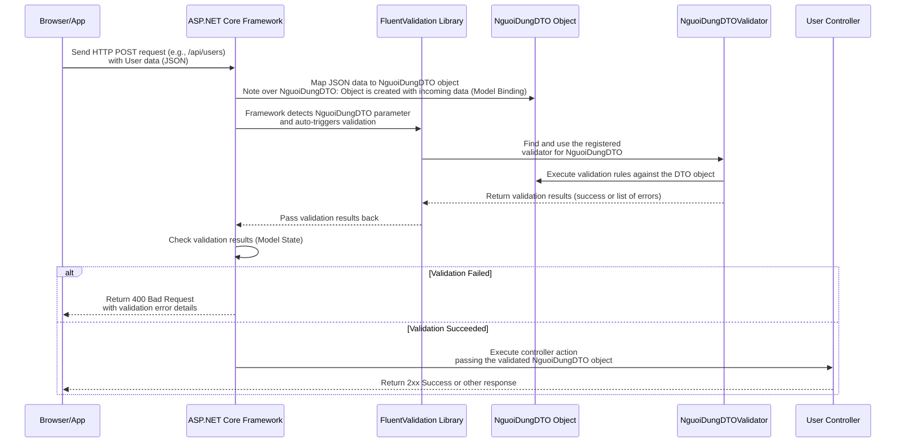

# Chapter 2: Validation (FluentValidation)

Welcome back! In [Chapter 1: Data Transfer Objects (DTOs)](01_data_transfer_objects__dtos__.md), we learned that DTOs are like standardized forms used to exchange data with our API. They define *what* data we expect.

But what happens if someone sends data that doesn't fill out the form correctly? What if they forget a required field, or provide a date that doesn't exist, or use an invalid email format?

This is where **Validation** comes in. Just like a good hotel receptionist checks if your booking details are correct before giving you a room key, our API needs to check if the data it receives is valid and makes sense *before* it tries to process it.

## Why Validate Data?

Imagine trying to save a new hotel booking in the database without knowing the guest's name or the check-in date. It would cause errors! Or imagine someone sending a ridiculously large number for the number of rooms – that could break things.

Validation is crucial for several reasons:

1.  **Preventing Bad Data:** It stops incorrect or incomplete data from entering our system (like the database).
2.  **Improving Reliability:** By ensuring we only process valid data, our API functions more predictably and crashes less often.
3.  **Better User Experience:** When validation fails, the API can send a clear message back to the client (like "Email address is invalid" or "Booking date is required"), helping the user correct their input.
4.  **Separation of Concerns:** Validation rules are kept separate from the core business logic, making the code cleaner and easier to manage.

In our `HotelManagementAPI` project, we use a popular library called **FluentValidation** to handle this process.

## Introducing FluentValidation

While the Data Annotations (`[Required]`, `[StringLength]`) we saw in Chapter 1 can do basic validation, FluentValidation offers a more powerful and flexible way to define complex validation rules. It's especially good because it keeps the validation rules *separate* from the DTO class definition, making the DTOs cleaner and focusing solely on the data structure.

FluentValidation works by defining **Validator classes**. Each validator class is responsible for checking the rules for a specific DTO class.

Think of it like this:

*   **DTO:** The blank form itself (e.g., `QuanTriVienThem1TienNghiDTO` - the form for adding a facility).
*   **Validator:** A set of instructions or a checklist for reviewing *that specific form* (e.g., a validator class for `QuanTriVienThem1TienNghiDTO` saying "check if the Name field is filled and not too long").

## How to Define Validation Rules with FluentValidation

Let's look at an example from our project. We have a DTO called `NguoiDungDTO` (User DTO), which represents data for a user (like registration or profile updates).

You can find its validator at `Validators/NguoiDungDTOValidator.cs`:

```csharp
using FluentValidation;
using HotelManagementAPI.DTOs;

// This class is the validator for the NguoiDungDTO
public class NguoiDungDTOValidator : AbstractValidator<NguoiDungDTO>
{
    // The constructor is where we define all the validation rules
    public NguoiDungDTOValidator()
    {
        // Rule for the 'Email' property
        RuleFor(x => x.Email)
            .NotEmpty().WithMessage("Email là bắt buộc.") // Rule: Must not be empty
            .EmailAddress().WithMessage("Email không hợp lệ."); // Rule: Must be a valid email format

        // Rule for the 'TenTaiKhoan' (Username) property
        RuleFor(x => x.TenTaiKhoan)
            .NotEmpty().WithMessage("Tên tài khoản là bắt buộc.")
            .MaximumLength(50).WithMessage("Tên tài khoản không được vượt quá 50 ký tự.");

        // Rule for the 'MatKhau' (Password) property
        RuleFor(x => x.MatKhau)
            .NotEmpty().WithMessage("Mật khẩu là bắt buộc.")
            .MaximumLength(100).WithMessage("Mật khẩu không được vượt quá 100 ký tự.");

        // Rule for 'HoTen' (Full Name)
        RuleFor(x => x.HoTen)
            .MaximumLength(100).WithMessage("Họ tên không được vượt quá 100 ký tự."); // Optional, but has max length

        // Rule for 'SoDienThoai' (Phone Number)
        RuleFor(x => x.SoDienThoai)
            .NotEmpty().WithMessage("Số điện thoại là bắt buộc."); // Just checks if not empty

        // Rule for 'DiaChi' (Address)
        RuleFor(x => x.DiaChi)
            .NotEmpty().WithMessage("Địa chỉ là bắt buộc."); // Just checks if not empty

        // Rule for 'CanCuocCongDan' (Citizen ID)
        RuleFor(x => x.CanCuocCongDan)
            .NotEmpty().WithMessage("Căn cước công dân là bắt buộc.")
            .MaximumLength(12).WithMessage("Căn cước công dân không được vượt quá 12 ký tự.");
    }
}
```

Let's break down the key parts:

*   `public class NguoiDungDTOValidator : AbstractValidator<NguoiDungDTO>`: This declares the validator class. It inherits from `AbstractValidator<T>`, where `T` is the DTO it validates (`NguoiDungDTO`). This tells FluentValidation *which* DTO this validator is for.
*   `public NguoiDungDTOValidator()`: The constructor. All validation rules are defined inside this constructor.
*   `RuleFor(x => x.Email)`: This is how you start defining rules for a specific property. `x` represents the `NguoiDungDTO` object being validated, and `x.Email` selects the `Email` property.
*   `.NotEmpty()`: This is a built-in validation rule provided by FluentValidation. It checks if the property's value is not null, empty, or whitespace (for strings).
*   `.EmailAddress()`: Another rule that specifically checks if the string value has a format that looks like an email address.
*   `.MaximumLength(100)`: Checks if the string value's length does not exceed 100 characters.
*   `.GreaterThanOrEqualTo(0)`: (Seen in other validators like `PhongDetailsDTOValidator`) Checks if a number is greater than or equal to 0.
*   `.InclusiveBetween(1, 5)`: (Seen in `FeedBackDTOvalidation`) Checks if a number is within a specified range (inclusive).
*   `.WithMessage("...")`: This allows you to specify a custom error message that will be returned if *this specific rule* fails. This is much more user-friendly than a generic error.

You chain these rules together using `.`. For example, `.NotEmpty().EmailAddress().WithMessage(...)` means "the property must not be empty AND must be a valid email format, and if either fails, use this message".

You define one `RuleFor` block for each property you want to validate.

## How FluentValidation is Used in the API (Behind the Scenes)

Our `HotelManagementAPI` project is set up to automatically use these validators. This setup happens when the application starts, in the `Program.cs` file.

Look for these lines in `Program.cs`:

```csharp
// ... other using statements ...
using FluentValidation;
using FluentValidation.AspNetCore; // Needed for ASP.NET Core integration

// ... code before builder.Build() ...

builder.Services.AddControllers(); // Configures controllers
builder.Services.AddFluentValidationAutoValidation(); // Tells ASP.NET Core to use FluentValidation automatically
builder.Services.AddFluentValidationClientsideAdapters(); // Optional: Helps generate client-side validation if needed (not used heavily in basic API)
builder.Services.AddValidatorsFromAssemblyContaining<Program>(); // Scans the project assembly to find all validators

// ... code after builder.Build() ...
```

*   `AddFluentValidationAutoValidation()`: This is the key line. It hooks FluentValidation into the ASP.NET Core's model validation process.
*   `AddValidatorsFromAssemblyContaining<Program>()`: This line tells FluentValidation to scan the assembly (the compiled project code) where the `Program.cs` file is located and automatically register *all* classes that inherit from `AbstractValidator` (like `NguoiDungDTOValidator`, `HoaDonDTOValidator`, etc.) so that the framework knows they exist and what DTO they validate.

Because of this setup, you *don't* need to manually write code in your API controllers to say "now validate this DTO". The framework does it *for* you automatically before the controller action method is even executed.

## The Validation Flow

When a request comes into an API endpoint that expects a DTO (like an endpoint to create a new user that takes `NguoiDungDTO` as a parameter), here's the simplified flow:



As you can see, if validation fails, the `ApiController` code *never even runs*. This keeps your controllers clean and focused on the business logic, assuming the data they receive is already valid.

## Benefits of FluentValidation in this Project

*   **Clean DTOs:** DTOs remain simple data containers without validation attributes cluttering them.
*   **Readable Rules:** The fluent interface (`RuleFor(...).NotEmpty()...`) is often easier to read and write, especially for complex rules.
*   **Reusable Validators:** A validator class can be reused anywhere that DTO is used as input.
*   **Clear Error Messages:** Easy to define custom, helpful messages.
*   **Automatic Integration:** Once configured in `Program.cs`, it runs automatically.

## Summary

In this chapter, we explored the vital concept of Validation. We learned why checking incoming data is essential for building robust and reliable APIs, preventing bad data from entering our system and providing clear feedback to users.

We saw how the `HotelManagementAPI` project uses FluentValidation to achieve this. We learned that FluentValidation uses separate Validator classes (`AbstractValidator<T>`) to define rules (`RuleFor`, `NotEmpty`, `EmailAddress`, etc.) for our DTOs. Finally, we understood that thanks to the setup in `Program.cs`, this validation happens automatically before our controller code processes the data, ensuring that our controllers always receive valid information.

Now that we know how data comes into our API (DTOs) and how we ensure that data is correct (Validation), we are ready to see where the actual API logic lives and how it receives and processes this validated data.

Let's move on to [Chapter 3: API Controllers](03_api_controllers_.md)!

---

<sub><sup>Generated by [AI Codebase Knowledge Builder](https://github.com/The-Pocket/Tutorial-Codebase-Knowledge).</sup></sub> <sub><sup>**References**: [[1]](https://github.com/Persinus/HotelManagementAPI/blob/36142c7f0bf93973f50c4408eb5a21a7f994eea2/Program.cs), [[2]](https://github.com/Persinus/HotelManagementAPI/blob/36142c7f0bf93973f50c4408eb5a21a7f994eea2/Validators/FeedBackDTOvalidation.cs), [[3]](https://github.com/Persinus/HotelManagementAPI/blob/36142c7f0bf93973f50c4408eb5a21a7f994eea2/Validators/HoaDonDTOValidator.cs), [[4]](https://github.com/Persinus/HotelManagementAPI/blob/36142c7f0bf93973f50c4408eb5a21a7f994eea2/Validators/LoginDTOValidator.cs), [[5]](https://github.com/Persinus/HotelManagementAPI/blob/36142c7f0bf93973f50c4408eb5a21a7f994eea2/Validators/NguoiDungDTOValidator.cs), [[6]](https://github.com/Persinus/HotelManagementAPI/blob/36142c7f0bf93973f50c4408eb5a21a7f994eea2/Validators/PhongAnhDTOValidator.cs), [[7]](https://github.com/Persinus/HotelManagementAPI/blob/36142c7f0bf93973f50c4408eb5a21a7f994eea2/Validators/PhongDetailsDTOValidator.cs), [[8]](https://github.com/Persinus/HotelManagementAPI/blob/36142c7f0bf93973f50c4408eb5a21a7f994eea2/Validators/ResetPasswordDTOValidator.cs), [[9]](https://github.com/Persinus/HotelManagementAPI/blob/36142c7f0bf93973f50c4408eb5a21a7f994eea2/Validators/ThanhToanDTOValidator.cs)</sup></sub>