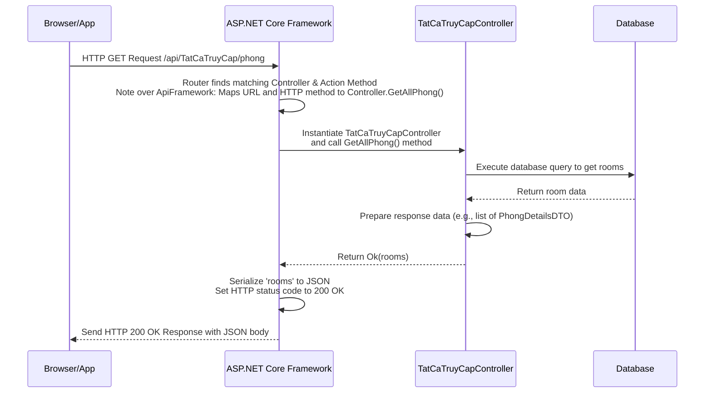

# Chapter 3: API Controllers

Welcome back! In the previous chapters, we've built the foundational pieces: [Chapter 1: Data Transfer Objects (DTOs)](01_data_transfer_objects__dtos__.md) taught us how to structure the data our API sends and receives, and [Chapter 2: Validation (FluentValidation)](02_validation__fluentvalidation__.md) showed us how to ensure that incoming data is correct and reliable.

Now that we know *what* data our API handles and how to check if it's valid, we need a place for this data to *arrive* and be processed. This is where **API Controllers** come in.

## What are API Controllers?

Think of our `HotelManagementAPI` as a hotel. Clients (like a user's web browser or mobile app) are guests who want to interact with the hotel (book a room, view services, update their profile).

**API Controllers** are like the **receptionists** of this hotel.

*   They sit at the main desk, ready to receive requests from guests (clients).
*   Each receptionist (controller) might specialize in a certain area (e.g., one for room bookings, one for guest services, one for administrative tasks).
*   They listen for specific questions or requests arriving at particular entry points (web addresses, called **endpoints**).
*   When a request arrives, the receptionist (controller) figures out *what* the guest wants, checks their credentials (if needed, covered in [Chapter 6: Authentication & Authorization (JWT)](06_authentication___authorization__jwt__.md)), maybe asks for some forms (DTOs) filled out correctly (validation, checked automatically thanks to [Chapter 2: Validation (FluentValidation)](02_validation__fluentvalidation__.md)), and then coordinates the actions needed behind the scenes (like checking room availability, fetching guest info from the database - covered in [Chapter 5: Database Access (Dapper)](05_database_access__dapper__.md)).
*   Finally, they prepare the necessary information (often using DTOs again) and give it back to the guest as a response.

In technical terms, an API Controller is a C# class that inherits from `ControllerBase` and contains methods (called **action methods**) that correspond to specific API endpoints (URLs) and HTTP request types (GET, POST, PUT, DELETE).

Let's look at an example from our project.

## Our First Controller Example: Getting Room Information

Imagine a user opens the hotel's website and wants to see a list of available rooms. Their browser sends a request to our API. A specific controller is needed to handle this "get list of rooms" request.

In our `HotelManagementAPI`, you'll find `TatCaTruyCapController.cs` in the `Controllers` folder. This controller handles requests that *don't* require the user to be logged in (hence `AllowAnonymous` and the name "TatCaTruyCap" which means "All Access").

Here's a simplified view of this controller class:

```csharp
using Microsoft.AspNetCore.Mvc;
using System.Data; // For IDbConnection (used for database access)
using System.Threading.Tasks;
using Dapper; // For Dapper methods (used for database access)
using HotelManagementAPI.DTOs; // For our DTOs
using Microsoft.AspNetCore.Authorization; // For AllowAnonymous

namespace HotelManagementAPI.Controllers.TatCaXemTatCaXem
{
    [ApiController] // 1. Marks this class as an API controller
    [AllowAnonymous] // Allows unauthenticated access (for this specific controller)
    [Route("api/TatCaTruyCap")] // 2. Sets the base route for this controller

    public class TatCaTruyCapController : ControllerBase // 3. Inherits from ControllerBase
    {
        private readonly IDbConnection _db; // 4. Holds database connection (more in Chapter 5)

        // Constructor: Gets dependencies like the database connection
        public TatCaTruyCapController(IDbConnection db)
        {
            _db = db;
        }

        /// <summary>
        /// Lấy tất cả phòng (chi tiết).
        /// </summary>
        [HttpGet("phong")] // 5. Defines an endpoint for GET requests at /api/TatCaTruyCap/phong
        public async Task<ActionResult<IEnumerable<PhongDetailsDTO>>> GetAllPhong() // 6. This is the action method
        {
            // 7. Code to get data from the database (using Dapper - see Chapter 5)
            const string roomQuery = @"
                SELECT p.MaPhong, p.LoaiPhong, p.GiaPhong, p.TinhTrang, p.SoLuongPhong, p.Tang,
                       p.KieuGiuong, p.MoTa, p.UrlAnhChinh, p.SucChua, p.SoGiuong,
                       p.DonViTinh, p.SoSaoTrungBinh
                FROM Phong p";
            var rooms = (await _db.QueryAsync<PhongDetailsDTO>(roomQuery)).ToList();

            // ... (Code to fetch related data like images, amenities, etc. - simplified) ...

            // 8. Return the data as an HTTP 200 OK response
            return Ok(rooms);
        }

        // ... other action methods like DangNhap (Login), DangKy (Register) ...
    }
}
```

Let's break down the key parts highlighted in the code:

1.  `[ApiController]`: This attribute is essential. It tells ASP.NET Core that this class is an API controller and enables several API-specific behaviors, such as automatic model validation (as seen in [Chapter 2](02_validation__fluentValidation__.md)) and attribute routing.
2.  `[Route("api/TatCaTruyCap")]`: This attribute defines the **base path** for all endpoints in this controller. Any route defined on an action method inside this controller will be appended to this base path. So, `api/TatCaTruyCap` is the starting point.
3.  `public class TatCaTruyCapController : ControllerBase`: All API controllers in ASP.NET Core inherit from `ControllerBase`. This base class provides access to helpful objects and methods, like `Request`, `Response`, `User`, `ModelState`, and various `IActionResult` helper methods (`Ok()`, `BadRequest()`, etc.) for creating standard HTTP responses.
4.  `private readonly IDbConnection _db;`: This declares a field to hold the database connection. The actual connection object is provided when the controller is created (via **Dependency Injection**, a core concept in ASP.NET Core configuration). We'll see how this `_db` object is used to interact with the database in [Chapter 5](05_database_access__dapper__.md).
5.  `[HttpGet("phong")]`: This attribute is placed on an **action method**. It specifies that this method should handle incoming **HTTP GET** requests, and the path segment `/phong` should be added to the controller's base route. The full endpoint for this method is `/api/TatCaTruyCap/phong`.
6.  `public async Task<ActionResult<IEnumerable<PhongDetailsDTO>>> GetAllPhong()`: This is the **action method** itself.
    *   `public async Task<...>`: Indicates that this method performs asynchronous operations (like database calls) and returns a `Task`. This is common practice in web APIs to avoid blocking the server thread.
    *   `ActionResult<IEnumerable<PhongDetailsDTO>>`: This is the return type. `ActionResult<T>` is a special ASP.NET Core type that allows you to return either a specific result of type `T` (in this case, a list (`IEnumerable`) of `PhongDetailsDTO` objects - see [Chapter 1](01_data_transfer_objects__dtos__.md)) *or* any other `IActionResult` (like `NotFound()`, `BadRequest()`, etc.). The framework will automatically handle formatting the `IEnumerable<PhongDetailsDTO>` into a standard response format (like JSON) if you return `Ok(data)`.
    *   `GetAllPhong()`: The name of the method. It's usually descriptive of the action it performs.
7.  **Database Interaction:** The lines using `_db` and `Dapper` are where the controller interacts with the database to fetch the requested room data. We'll explore this in depth in [Chapter 5](05_database_access__dapper__.md).
8.  `return Ok(rooms);`: This is how the controller sends a response back to the client. `Ok()` is a helper method from `ControllerBase` that creates an HTTP response with a **200 OK** status code. When you pass an object to `Ok()`, the framework automatically serializes that object into a standard format (like JSON) in the response body.

## The Flow: Request to Response

Let's trace what happens when a client sends a GET request to `/api/TatCaTruyCap/phong`:



This diagram shows how the ASP.NET Core framework acts as a mediator, receiving the request, figuring out which controller and action method should handle it, and then sending back the response generated by the controller.

## Handling Different Request Types and Data

Controllers aren't just for GET requests. They handle all standard HTTP methods (verbs). Each verb typically corresponds to a different type of action:

| HTTP Verb | Common Use Case           | Controller Attribute | Example Endpoint & Action      |
| :-------- | :------------------------ | :------------------- | :----------------------------- |
| `GET`     | Retrieve data             | `[HttpGet]`          | `/api/rooms` (GetAll)        |
| `POST`    | Create new data           | `[HttpPost]`         | `/api/rooms` (CreateNew)     |
| `PUT`     | Update existing data      | `[HttpPut]`          | `/api/rooms/{id}` (Update by ID) |
| `DELETE`  | Delete existing data      | `[HttpDelete]`       | `/api/rooms/{id}` (Delete by ID) |

Controllers also define how they receive data from the client:

*   **From the URL path (Route Parameters):** Use `[FromRoute]` or just define parameters in the method signature matching segments in the `[Route]` or `[HttpGet]` etc. attribute that are enclosed in `{}`. Example: `[HttpGet("{id}")] public IActionResult GetRoom(string id)` where `id` comes from the URL like `/api/rooms/P001`.
*   **From the Request Body:** Use `[FromBody]` for data sent in the body of the request, typically JSON. The framework automatically maps the JSON to a parameter, usually a DTO. Example: `[HttpPost] public IActionResult CreateRoom([FromBody] CreateRoomDTO roomData)`. This uses the DTO concept from [Chapter 1](01_data_transfer_objects__dtos__.md).
*   **From Query Parameters:** Parameters added to the URL after a `?`. Example: `[HttpGet("search")] public IActionResult SearchRooms([FromQuery] string type)` where `type` comes from `/api/rooms/search?type=Deluxe`.
*   **From Form Data:** Data sent as form fields, often used for file uploads. Use `[FromForm]`. Example: `[HttpPost("upload")] public async Task<IActionResult> Upload([FromForm] IFormFile file)`.

Let's look at `TatCaTruyCapController` again, specifically the `DangNhap` (Login) method, to see `[HttpPost]` and `[FromBody]` in action:

```csharp
// Inside TatCaTruyCapController.cs
// ... other methods ...

/// <summary>
/// Đăng nhập hệ thống.
/// </summary>
/// <param name="login">Thông tin đăng nhập (LoginDTO)</param> // Parameter comes from the request body
[HttpPost("dangnhap")] // Handles POST requests at /api/TatCaTruyCap/dangnhap
public async Task<ActionResult<string>> DangNhap([FromBody] LoginDTO login) // Accepts LoginDTO from the body
{
    // 1. Data (LoginDTO) is automatically received and validated here
    //    (Thanks to [ApiController] and the setup in Program.cs - see Chapter 2)

    // 2. Fetch user from database based on login.TenTaiKhoan
    const string query = "SELECT * FROM NguoiDung WHERE TenTaiKhoan = @TenTaiKhoan";
    var nguoiDung = await _db.QueryFirstOrDefaultAsync<NguoiDungDTO>(query, new { login.TenTaiKhoan });

    if (nguoiDung == null)
        return Unauthorized(new { Message = "Tên tài khoản hoặc mật khẩu không đúng 1." }); // Return HTTP 401 Unauthorized

    // 3. Verify password (using BCrypt)
    bool isValid = BCrypt.Net.BCrypt.Verify(login.MatKhau, nguoiDung.MatKhau);
    if (!isValid)
        return Unauthorized(new { Message = "Tên tài khoản hoặc mật khẩu không đúng 2." }); // Return HTTP 401 Unauthorized

    // 4. Generate JWT Token (Authentication/Authorization - see Chapter 6)
    var secretKey = _config["Jwt:SecretKey"]; // Get config settings (Chapter 8)
    // ... jwt generation code ...
    var token = JwtHelper.GenerateJwtToken(nguoiDungModel, secretKey, issuer, audience);


    // 5. Return success response with the token
    return Ok(new { Token = token }); // Return HTTP 200 OK with token in JSON body
}

// ... other methods ...
```

In this `DangNhap` example:
*   `[HttpPost("dangnhap")]` maps the POST request to this method.
*   `[FromBody] LoginDTO login` tells the framework to take the JSON data from the request body and try to convert it into a `LoginDTO` object. This is **Model Binding**. Because of `[ApiController]` and the FluentValidation setup, this DTO is automatically validated *before* the method body executes. If validation fails, the framework returns a `400 Bad Request` response automatically, and this method is never called (as shown in the validation flow diagram in [Chapter 2](02_validation__fluentvalidation__.md)).
*   The method then uses the data from the `login` DTO to perform actions (querying the database, verifying password, generating a token).
*   It returns either `Unauthorized()` (HTTP 401) if login fails or `Ok()` (HTTP 200) with the generated token if successful.

## Organising Controllers

In larger applications, you'll often group controllers by feature or by the type of user that interacts with them. In `HotelManagementAPI`, you can see this pattern:

*   `Controllers/TatCaTruyCapController.cs`: For endpoints accessible to everyone (login, register, view public info).
*   `Controllers/KhachHangController.cs`: For endpoints specific to logged-in customers. Notice it has `[Authorize(Roles = "KhachHang")]` (covered in [Chapter 6](06_authentication___authorization__jwt__.md)).
*   `Controllers/NhanVienController.cs`: For employee-specific endpoints (`[Authorize(Roles = "NhanVien")]`).
*   `Controllers/QuanTriVien/`: A subfolder for administrator-specific controllers (`[Authorize(Roles = "QuanTriVien")]`), like `QuanTriVienPhongController.cs` or `QuanTriVien_QuanLyDichVuQTVController.cs`.

This organization helps keep the codebase manageable and reflects the structure of the API's features and access levels.

## Summary

In this chapter, we learned that API Controllers are the entry points for client requests in our `HotelManagementAPI`. They act like receptionists, receiving requests at specific endpoints (defined by `[Route]` and HTTP verb attributes like `[HttpGet]`, `[HttpPost]`), processing the incoming data (often mapped automatically to DTOs using `[FromBody]`), performing necessary actions (like interacting with the database), and returning appropriate responses (`IActionResult` like `Ok`, `BadRequest`, `NotFound`).

We saw how attributes like `[ApiController]`, `[Route]`, and the HTTP verb attributes are used to define controllers and their endpoints, and how the framework uses Model Binding to provide the action methods with the data they need. We also touched on how controllers are organized in the project.

Now that we understand how requests arrive and are handled by controllers, the next logical step is to look at how the data is structured *within* our application, especially when dealing with the database.

Let's move on to [Chapter 4: Database Models](04_database_models_.md) to see how we represent the information our controllers work with.

---

<sub><sup>Generated by [AI Codebase Knowledge Builder](https://github.com/The-Pocket/Tutorial-Codebase-Knowledge).</sup></sub> <sub><sup>**References**: [[1]](https://github.com/Persinus/HotelManagementAPI/blob/36142c7f0bf93973f50c4408eb5a21a7f994eea2/Controllers/CloudinanyController.cs), [[2]](https://github.com/Persinus/HotelManagementAPI/blob/36142c7f0bf93973f50c4408eb5a21a7f994eea2/Controllers/KhachHangController.cs), [[3]](https://github.com/Persinus/HotelManagementAPI/blob/36142c7f0bf93973f50c4408eb5a21a7f994eea2/Controllers/NhanVienController.cs), [[4]](https://github.com/Persinus/HotelManagementAPI/blob/36142c7f0bf93973f50c4408eb5a21a7f994eea2/Controllers/QuanTriVien/QuanTriVienController.cs), [[5]](https://github.com/Persinus/HotelManagementAPI/blob/36142c7f0bf93973f50c4408eb5a21a7f994eea2/Controllers/QuanTriVien/QuanTriVienPhongController.cs), [[6]](https://github.com/Persinus/HotelManagementAPI/blob/36142c7f0bf93973f50c4408eb5a21a7f994eea2/Controllers/QuanTriVien/QuanTriVien_HeThongController.cs), [[7]](https://github.com/Persinus/HotelManagementAPI/blob/36142c7f0bf93973f50c4408eb5a21a7f994eea2/Controllers/QuanTriVien/QuanTriVien_QuanLyDichVuQTVController.cs), [[8]](https://github.com/Persinus/HotelManagementAPI/blob/36142c7f0bf93973f50c4408eb5a21a7f994eea2/Controllers/TatCaTruyCapController.cs), [[9]](https://github.com/Persinus/HotelManagementAPI/blob/36142c7f0bf93973f50c4408eb5a21a7f994eea2/Controllers/VnPayController.cs), [[10]](https://github.com/Persinus/HotelManagementAPI/blob/36142c7f0bf93973f50c4408eb5a21a7f994eea2/Controllers/XacThucController.cs)</sup></sub>