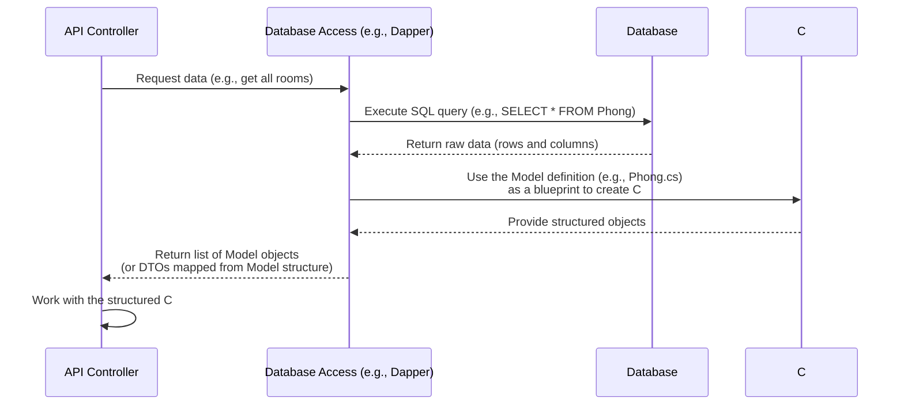

# Chapter 4: Database Models

Welcome back to the HotelManagementAPI tutorial!

In the previous chapter, [Chapter 3: API Controllers](03_api_controllers_.md), we learned that controllers are the "receptionists" that receive requests from clients and decide what needs to be done. Often, what needs to be done involves interacting with the data stored in our application's database.

But how does our C# code, which works with objects and properties, talk to a database, which works with tables and columns? We need a way to translate between the two.

This is where **Database Models**, or sometimes just called "Models" or "Entity Models", come in.

## What are Database Models?

Think of our hotel's database as a filing cabinet filled with organized folders and documents. We have a folder for "Users", a folder for "Rooms", a folder for "Bookings", and so on. Each folder contains many documents (records), and each document has specific fields (pieces of information) like "User ID", "Name", "Email" in a User document, or "Room Number", "Type", "Price" in a Room document.

**Database Models** are the **blueprints** or **templates** in our C# code that match the structure of these database folders (tables) and documents (records).

*   Each **Model class** in our C# code represents a **table** in the database.
*   Each **property** (like `public string Name { get; set; }`) within a Model class represents a **column** in that database table.

When our application needs to get data from the database, the database sends back raw data. The application uses these Model blueprints to take that raw data and turn it into structured C# objects that our code can easily understand and work with. Similarly, when we want to save new data or update existing data, we create or modify these Model objects, and the application uses their blueprint to format the data correctly for the database.

In the `HotelManagementAPI` project, you'll find these model classes mostly located in the `Models` folder.

## Looking at a Model Example: The `Phong` Model

Let's look at the `Phong.cs` file in the `Models` folder. This file contains the definition for the `Phong` (Room) model, which represents the `Phong` table in our database.

```csharp
// File: Models/Phong.cs
using System;
using System.Collections.Generic;

namespace HotelManagementAPI.Models;

public partial class Phong
{
    // Corresponds to the 'MaPhong' column in the database table
    public string MaPhong { get; set; } = null!;

    // Corresponds to the 'LoaiPhong' column
    public string LoaiPhong { get; set; } = null!;

    // Corresponds to the 'GiaPhong' column
    public decimal GiaPhong { get; set; }

    // Corresponds to the 'TinhTrang' column (e.g., 0=Available, 1=Booked)
    public byte TinhTrang { get; set; }

    // And many other properties matching database columns...
    public int SoLuongPhong { get; set; }
    public int Tang { get; set; }
    public string KieuGiuong { get; set; } = null!;
    public string? MoTa { get; set; }
    public string UrlAnhChinh { get; set; } = null!;
    public int SucChua { get; set; }
    public int SoGiuong { get; set; }
    public string DonViTinh { get; set; } = null!;
    public decimal SoSaoTrungBinh { get; set; }

    // These represent relationships to other tables (collections of related models)
    public virtual ICollection<DatPhong> DatPhongs { get; set; } = new List<DatPhong>();
    public virtual ICollection<Feedback> Feedbacks { get; set; } = new List<Feedback>();
    public virtual ICollection<PhongAnh> PhongAnhs { get; set; } = new List<PhongAnh>();
    // ... and other relationship properties
}
```

Let's break this down:

*   `public partial class Phong`: This declares the C# class named `Phong`. The `partial` keyword just means the class definition might be split across multiple files, which is sometimes done by automatic code generators (like Entity Framework Core, though this project uses Dapper for *most* direct data access, these models might have been generated initially or kept for structure definition).
*   `namespace HotelManagementAPI.Models;`: This indicates where this class is located within the project structure.
*   `public string MaPhong { get; set; } = null!;`: This defines a property named `MaPhong` of type `string`. This property is designed to hold the value from the `MaPhong` column in the `Phong` database table. The `{ get; set; }` part makes it an auto-property, meaning you can easily read and write its value. `null!` is a C# 8 feature indicating it's not expected to be null (often corresponds to a non-nullable database column).
*   `public decimal GiaPhong { get; set; }`: This defines a property `GiaPhong` of type `decimal`, corresponding to the room price column. Different data types are used based on the type of data in the database column (string for text, decimal for money, int for numbers, DateTime for dates, etc.).
*   `public virtual ICollection<DatPhong> DatPhongs { get; set; } = new List<DatPhong>();`: This is special. It represents a **relationship**! A single `Phong` (Room) can have many `DatPhong` (Room Booking) records associated with it. This property allows us to access the list of bookings related to a specific room object directly in our C# code. `ICollection<T>` is used for "one-to-many" or "many-to-many" relationships where one room is linked to multiple bookings. `virtual` is often used with database libraries to allow for features like "lazy loading" (loading related data only when you access this property).

Every `.cs` file in the `Models` folder (like `NguoiDung.cs`, `DatPhong.cs`, `HoaDon.cs`, etc.) follows this pattern, providing a C# object blueprint for its corresponding database table.

## The Database Context: `DataQlks115Nhom2Context`

Besides the individual model classes, you'll find a class that represents the entire database itself, like `DataQlks115Nhom2Context.cs` (or potentially `Hotelnhom2Context.cs`, depending on the exact configuration, but they serve the same purpose) in the `Models` folder.

```csharp
// File: Models/DataQlks115Nhom2Context.cs (simplified)
using Microsoft.EntityFrameworkCore; // Even if Dapper is used for queries, DbContext might define structure

namespace HotelManagementAPI.Models;

// This class represents the entire database connection and structure
public partial class DataQlks115Nhom2Context : DbContext // Inherits from DbContext
{
    // Constructor, often configured in Program.cs
    public DataQlks115Nhom2Context(DbContextOptions<DataQlks115Nhom2Context> options)
        : base(options)
    {
    }

    // DbSet properties represent the collections (tables) in the database
    public virtual DbSet<BaiViet> BaiViets { get; set; }
    public virtual DbSet<BaoCao> BaoCaos { get; set; }
    // ...
    public virtual DbSet<NguoiDung> NguoiDungs { get; set; } // Represents the 'NguoiDung' table
    // ...
    public virtual DbSet<Phong> Phongs { get; set; } // Represents the 'Phong' table
    // ...
    public virtual DbSet<TienNghi> TienNghis { get; set; } // Represents the 'TienNghi' table
    // ... many other DbSet properties for each table/Model

    // This method is used to configure the mapping between models and database
    protected override void OnModelCreating(ModelBuilder modelBuilder)
    {
        // Configuration details for each entity (Model)
        modelBuilder.Entity<NguoiDung>(entity =>
        {
            entity.HasKey(e => e.MaNguoiDung).HasName("PK__NguoiDun__C539D76271D1E9B0"); // Primary key
            entity.ToTable("NguoiDung"); // Map to "NguoiDung" table
            // Further property/relationship configurations...
            entity.Property(e => e.Email).HasMaxLength(100);
            // ...
        });
        // ... Configuration for other entities (Phong, HoaDon, etc.) ...

        OnModelCreatingPartial(modelBuilder);
    }

    partial void OnModelCreatingPartial(ModelBuilder modelBuilder);
}
```

*   `public partial class DataQlks115Nhom2Context : DbContext`: This class inherits from `DbContext`, which is a class from Entity Framework Core (even if Dapper is used for querying, EF Core's `DbContext` is sometimes used purely for its model definition and migration capabilities). It acts as the main bridge between your application and the database.
*   `public virtual DbSet<Phong> Phongs { get; set; }`: A `DbSet` property represents a collection of all entities (records) of a specific Model type in the database. You interact with the database tables through these `DbSet` properties in code. For example, `_dbContext.Phongs` would represent the entire `Phong` table.
*   `OnModelCreating`: This method is where detailed configurations are defined, specifying things like table names, primary keys, column data types and lengths, and how relationships (`HasOne`, `WithMany`, `UsingEntity`) are mapped.

Even though the `HotelManagementAPI` project uses Dapper (which we'll cover in [Chapter 5: Database Access (Dapper)](05_database_access__dapper__.md)) for most database queries, these `Models` and the `DbContext` class still serve as the central source of truth for the database structure within the C# project. They define the shape of the data we expect to store and retrieve.

## How Models are Used (Connecting to Controllers)

Let's briefly connect this back to the controller example we saw in [Chapter 3](03_api_controllers_.md), the `GetAllPhong` method in `TatCaTruyCapController`.

Remember this snippet?

```csharp
// Inside TatCaTruyCapController.cs
// ...
[HttpGet("phong")]
public async Task<ActionResult<IEnumerable<PhongDetailsDTO>>> GetAllPhong()
{
    const string roomQuery = @"
        SELECT p.MaPhong, p.LoaiPhong, p.GiaPhong, p.TinhTrang, p.SoLuongPhong, p.Tang,
               p.KieuGiuong, p.MoTa, p.UrlAnhChinh, p.SucChua, p.SoGiuong,
               p.DonViTinh, p.SoSaoTrungBinh
        FROM Phong p";
    // This line uses Dapper to execute the query and map results
    // It maps directly to PhongDetailsDTO, which has properties matching the query columns
    var rooms = (await _db.QueryAsync<PhongDetailsDTO>(roomQuery)).ToList();

    // ... (Code to fetch related data and add to DTOs - simplified) ...

    return Ok(rooms); // Return the list of DTOs
}
// ...
```

Notice that this specific Dapper query mapped the results directly into `PhongDetailsDTO` (a DTO, as discussed in [Chapter 1](01_data_transfer_objects__dtos__.md)) instead of the `Phong` Model. This is a common pattern when using libraries like Dapper: you can map the query results directly into *any* class (a Model or a DTO) as long as the property names in the class match the column names returned by the SQL query.

However, the `Phong` Model in `Models/Phong.cs` still represents the underlying database structure that the query is based on. While the code might skip mapping to the `Phong` Model object itself before creating the `PhongDetailsDTO`, the `Phong` Model is the C# definition of the database table's structure that informed both the database schema and the design of the `PhongDetailsDTO`.

In other parts of the application, especially if using Entity Framework Core more directly, you would explicitly work with `Phong` model objects like this (hypothetically, if using EF Core):

```csharp
// Hypothetical example using Entity Framework Core
// (This project uses Dapper, but shows how models are used with ORMs)
// Assume _dbContext is an instance of DataQlks115Nhom2Context
var allRoomsFromDb = _dbContext.Phongs.ToList(); // Get all Phong MODEL objects
// Now 'allRoomsFromDb' is a List<Phong>, where each item is a Phong object
// You can access properties like room.MaPhong, room.GiaPhong, etc.

// Then you would often map these Model objects to DTOs for the API response
var roomDTOs = allRoomsFromDb.Select(room => new PhongDetailsDTO
{
    MaPhong = room.MaPhong,
    LoaiPhong = room.LoaiPhong,
    GiaPhong = room.GiaPhong,
    // ... map other properties ...
}).ToList();

return Ok(roomDTOs); // Return the list of DTOs
```
This hypothetical example better shows the role of the Database Model (`Phong`) as the object representing data *as it is structured in the database* before it might be transformed into a DTO (`PhongDetailsDTO`) for sending outside the API.

## The Flow: Database Data to C# Object

Here's a simplified look at how database data becomes a C# Model object (or an object shaped like a Model) for your application to use:



This diagram shows that the Database Access layer ([Chapter 5](05_database_access__dapper__.md)) is responsible for fetching the raw data and using the structure defined in your Model classes to hydrate (fill with data) C# objects that the rest of your application code, like controllers, can easily use.

## Summary

In this chapter, we introduced the concept of Database Models. We learned that these are C# classes (found in the `Models` folder) that serve as blueprints for the tables and records in our database. Each property in a Model class corresponds to a column, and special properties represent relationships between tables.

We saw examples of a simple `Phong` (Room) model and the central `DataQlks115Nhom2Context` class that manages the overall database structure mapping. We understood that while our project uses Dapper which might sometimes map query results directly into DTOs, the Model classes fundamentally define the structure of the data as it exists in the database, providing the foundation for how our application interacts with storage.

Models are the **"what"** of our database interaction – they define the shape of the data. In the next chapter, we'll look at the **"how"** – how we actually execute queries and get/save data using a library called Dapper.

Ready to see how we use code to talk to the database using these models? Let's go to [Chapter 5: Database Access (Dapper)](05_database_access__dapper__.md)!

---

<sub><sup>Generated by [AI Codebase Knowledge Builder](https://github.com/The-Pocket/Tutorial-Codebase-Knowledge).</sup></sub> <sub><sup>**References**: [[1]](https://github.com/Persinus/HotelManagementAPI/blob/36142c7f0bf93973f50c4408eb5a21a7f994eea2/Models/BaiViet.cs), [[2]](https://github.com/Persinus/HotelManagementAPI/blob/36142c7f0bf93973f50c4408eb5a21a7f994eea2/Models/BaoCao.cs), [[3]](https://github.com/Persinus/HotelManagementAPI/blob/36142c7f0bf93973f50c4408eb5a21a7f994eea2/Models/ChiTietBaoCao.cs), [[4]](https://github.com/Persinus/HotelManagementAPI/blob/36142c7f0bf93973f50c4408eb5a21a7f994eea2/Models/ChiTietHoaDon.cs), [[5]](https://github.com/Persinus/HotelManagementAPI/blob/36142c7f0bf93973f50c4408eb5a21a7f994eea2/Models/DatDichVu.cs), [[6]](https://github.com/Persinus/HotelManagementAPI/blob/36142c7f0bf93973f50c4408eb5a21a7f994eea2/Models/DatPhong.cs), [[7]](https://github.com/Persinus/HotelManagementAPI/blob/36142c7f0bf93973f50c4408eb5a21a7f994eea2/Models/DataQlks115Nhom2Context.cs), [[8]](https://github.com/Persinus/HotelManagementAPI/blob/36142c7f0bf93973f50c4408eb5a21a7f994eea2/Models/DichVu.cs), [[9]](https://github.com/Persinus/HotelManagementAPI/blob/36142c7f0bf93973f50c4408eb5a21a7f994eea2/Models/Feedback.cs), [[10]](https://github.com/Persinus/HotelManagementAPI/blob/36142c7f0bf93973f50c4408eb5a21a7f994eea2/Models/GiamGium.cs), [[11]](https://github.com/Persinus/HotelManagementAPI/blob/36142c7f0bf93973f50c4408eb5a21a7f994eea2/Models/HoaDon.cs), [[12]](https://github.com/Persinus/HotelManagementAPI/blob/36142c7f0bf93973f50c4408eb5a21a7f994eea2/Models/Hotelnhom2Context.cs), [[13]](https://github.com/Persinus/HotelManagementAPI/blob/36142c7f0bf93973f50c4408eb5a21a7f994eea2/Models/LichSuGiaoDich.cs), [[14]](https://github.com/Persinus/HotelManagementAPI/blob/36142c7f0bf93973f50c4408eb5a21a7f994eea2/Models/NguoiDung.cs), [[15]](https://github.com/Persinus/HotelManagementAPI/blob/36142c7f0bf93973f50c4408eb5a21a7f994eea2/Models/NoiQuy.cs), [[16]](https://github.com/Persinus/HotelManagementAPI/blob/36142c7f0bf93973f50c4408eb5a21a7f994eea2/Models/Phong.cs), [[17]](https://github.com/Persinus/HotelManagementAPI/blob/36142c7f0bf93973f50c4408eb5a21a7f994eea2/Models/PhongAnh.cs), [[18]](https://github.com/Persinus/HotelManagementAPI/blob/36142c7f0bf93973f50c4408eb5a21a7f994eea2/Models/PhongYeuThich.cs), [[19]](https://github.com/Persinus/HotelManagementAPI/blob/36142c7f0bf93973f50c4408eb5a21a7f994eea2/Models/ThanhToan.cs), [[20]](https://github.com/Persinus/HotelManagementAPI/blob/36142c7f0bf93973f50c4408eb5a21a7f994eea2/Models/TienNghi.cs)</sup></sub>