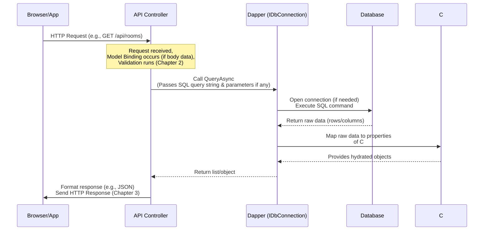

# Chapter 5: Database Access (Dapper)

Welcome back to the HotelManagementAPI tutorial!

In the last chapter, [Chapter 4: Database Models](04_database_models_.md), we explored how **Database Models** provide C# blueprints that mirror the structure of our database tables. We saw classes like `Phong` (Room) with properties matching database columns. Knowing *what* our data looks like in the database is crucial, but it doesn't tell us *how* to actually get that data from the database into our C# objects, or how to save changes from our objects back into the database.

That's the job of **Database Access**. In the `HotelManagementAPI` project, we use a popular, lightweight tool called **Dapper** for this task.

## Why Dapper? The Filing Clerk Analogy

Imagine our hotel's database is a massive physical archive room filled with filing cabinets (tables). Each cabinet has folders (records/rows) containing forms (columns/fields).

Getting information or adding new information isn't as simple as just *thinking* about the data model (the structure of the forms). You need a **Filing Clerk** who knows how to:
1.  Receive a specific request ("Get all guest names", "Find booking details for room P001 on date X", "Add a new staff member").
2.  Go to the right cabinet and folder.
3.  Efficiently retrieve or store the required information.
4.  Organize the fetched information neatly before handing it back.

Without a good system or a skilled clerk, interacting with the archive would be slow, prone to errors, and require a lot of manual steps for every single request.

In software, interacting with a database directly using the basic tools provided (like `SqlConnection` and `SqlCommand` in .NET) is like being your *own* clerk, doing everything manually. You have to:
*   Open a connection.
*   Write the SQL query as a string.
*   Create a command object.
*   Add parameters carefully to the command.
*   Execute the command.
*   Read the results one column at a time using a data reader.
*   Manually assign each piece of data from the data reader to the correct property of your C# object.
*   Handle closing connections and cleaning up resources.

This is tedious and repetitive!

**Dapper is like our highly efficient, specialized Filing Clerk.** It takes your SQL instructions and automatically handles the messy parts: executing the query and, most importantly, taking the results from the database and automatically mapping them to the properties of your C# objects (like our DTOs or Models) based on matching names.

Dapper is often called a lightweight **ORM** (Object-Relational Mapper), but it's more accurate to call it a micro-ORM. It focuses mainly on the "mapping" part – turning database results into objects – rather than trying to hide SQL completely or provide complex database change tracking like a full ORM (like Entity Framework Core) might. This makes Dapper very fast and gives you direct control over the SQL you write.

## The Essential Tool: `IDbConnection`

The central piece Dapper needs to work with is a database connection. In .NET, this is represented by the `IDbConnection` interface.

Our `HotelManagementAPI` project is configured to create and manage these connections for us using **Dependency Injection** (a core ASP.NET Core concept covered later in [Chapter 8: Application Configuration](08_application_configuration_.md)).

Look at the `Program.cs` file:

```csharp
// File: Program.cs (simplified)
using System.Data; // Required for IDbConnection
using Microsoft.Data.SqlClient; // Required for SqlConnection
// ... other using statements ...

// ... code before builder.Build() ...

// Cấu hình chuỗi kết nối (Configure the connection string)
var connectionString = builder.Configuration.GetConnectionString("DefaultConnection");

// Đăng ký IDbConnection với DI (Register IDbConnection with DI)
// When someone needs an IDbConnection, give them a new SqlConnection
builder.Services.AddScoped<IDbConnection>(sp => new SqlConnection(connectionString));

// ... rest of setup ...
```

This code snippet does two main things related to the database connection:
1.  It reads the database connection string (the address and credentials for the database) from the application's configuration ([Chapter 8](08_application_configuration_.md)).
2.  It registers a service in ASP.NET Core's built-in Dependency Injection container. `AddScoped` means that for every incoming API request, a *new* `SqlConnection` (which implements `IDbConnection`) will be created and will be available to controllers or services that need it. This is a standard and safe way to handle database connections in web applications.

Thanks to this setup, any controller or service class can simply *ask* for an `IDbConnection` in its constructor, and the framework will automatically provide the configured database connection. You saw this in [Chapter 3: API Controllers](03_api_transfer_objects__dtos__.md):

```csharp
// Inside a Controller class (simplified)
private readonly IDbConnection _db; // Declare a field to hold the connection

// Constructor: Ask for the IDbConnection
public TatCaTruyCapController(IDbConnection db)
{
    _db = db; // Store the provided connection
}
// Now you can use _db in your action methods!
```

## Using Dapper to Read Data (`QueryAsync`, `QueryFirstOrDefaultAsync`)

The most common task is reading data from the database. Dapper provides convenient extension methods on the `IDbConnection` interface to execute SQL queries and map the results. The main methods for reading are:

*   `QueryAsync<T>`: Used when your SQL query is expected to return **multiple rows**. Dapper will execute the query and return an `IEnumerable<T>` where `T` is the type (Model or DTO) you want the rows mapped to.
*   `QueryFirstOrDefaultAsync<T>`: Used when your SQL query is expected to return **at most one row**. Dapper will execute the query and return an object of type `T` if a row is found, or `null` if no row is found.
*   `ExecuteScalarAsync<T>`: Used when your SQL query returns a **single value** (like `COUNT(*)`). Dapper will execute the query and return that single value cast to type `T`.

Let's look at examples from the project.

### Example 1: Getting All Rooms (`QueryAsync`)

We saw this in [Chapter 3: API Controllers](03_api_controllers_.md), in the `GetAllPhong` method of `TatCaTruyCapController`. It fetches all rooms and maps them to `PhongDetailsDTO`s.

```csharp
// Inside TatCaTruyCapController.cs (simplified)

[HttpGet("phong")]
public async Task<ActionResult<IEnumerable<PhongDetailsDTO>>> GetAllPhong()
{
    // 1. Define the SQL query as a string.
    //    Selects specific columns matching PhongDetailsDTO properties.
    const string roomQuery = @"
        SELECT p.MaPhong, p.LoaiPhong, p.GiaPhong, p.TinhTrang, p.Tang,
               p.KieuGiuong, p.MoTa, p.UrlAnhChinh, p.SucChua, p.SoGiuong,
               p.DonViTinh, p.SoSaoTrungBinh
        FROM Phong p"; // Selecting from the Phong table

    // 2. Use Dapper's QueryAsync method.
    //    <PhongDetailsDTO>: Tells Dapper to map each row to a PhongDetailsDTO object.
    //    _db: The IDbConnection instance provided by DI.
    var rooms = (await _db.QueryAsync<PhongDetailsDTO>(roomQuery)).ToList();

    // ... (Code to fetch related data - we'll simplify for this example) ...

    // 3. Return the results (list of PhongDetailsDTOs).
    return Ok(rooms);
}
```

**Explanation:**

*   `const string roomQuery = ...`: We write the standard SQL query. Notice we are selecting columns (`MaPhong`, `LoaiPhong`, etc.). Dapper works best when you explicitly select the columns you need, and importantly, the names of these columns **must match** the names of the properties in your target C# class (`PhongDetailsDTO` in this case) for automatic mapping to work.
*   `await _db.QueryAsync<PhongDetailsDTO>(roomQuery)`: This is the core Dapper call. It tells Dapper to execute `roomQuery` on the `_db` connection. The `<PhongDetailsDTO>` part is crucial – it instructs Dapper to take each row returned by the database and try to create a `PhongDetailsDTO` object from it. Dapper looks for properties in `PhongDetailsDTO` with names matching the column names in the result set.
*   `.ToList()`: `QueryAsync` returns an `IEnumerable<T>`, which is a stream of objects. `.ToList()` converts this into a `List<PhongDetailsDTO>`, which is often easier to work with.

Dapper handles reading the data from the database result set and assigning the values to the correct properties of each `PhongDetailsDTO` object it creates. If a column name doesn't match a property name in the target class, Dapper simply ignores it.

### Example 2: Getting a Single User Profile (`QueryFirstOrDefaultAsync`)

In `XacThucController`, the `GetProfile` method fetches a single user's information.

```csharp
// Inside XacThucController.cs (simplified)

[HttpGet("profile")]
public async Task<IActionResult> GetProfile()
{
    // Get the user ID from the authenticated user's token (covered in Chapter 6)
    var maNguoiDung = User.FindFirstValue("sub"); // e.g., "ND001"
    if (string.IsNullOrEmpty(maNguoiDung))
        return Unauthorized(new { Message = "User ID not found." });

    // 1. Define the SQL query to get a *single* row by ID.
    //    Notice the parameter placeholder: @MaNguoiDung
    const string query = @"SELECT * FROM NguoiDung WHERE MaNguoiDung = @MaNguoiDung";

    // 2. Use Dapper's QueryFirstOrDefaultAsync method.
    //    <NguoiDungDTO>: Map result to NguoiDungDTO.
    //    new { MaNguoiDung = maNguoiDung }: Provides values for parameters.
    var profile = await _db.QueryFirstOrDefaultAsync<NguoiDungDTO>(query, new { MaNguoiDung = maNguoiDung });

    // 3. Check if a row was found and return the result.
    if (profile == null)
        return NotFound(new { Message = "User not found." });

    // ... (Code to decrypt sensitive data - simplified) ...

    return Ok(profile); // Return the single NguoiDungDTO object
}
```

**Explanation:**

*   `const string query = ... WHERE MaNguoiDung = @MaNguoiDung`: The SQL query uses `@MaNguoiDung`. This is a **parameter placeholder**. Using parameters is the **correct and safe way** to pass values into SQL queries (instead of putting the C# variable directly into the SQL string, which can lead to SQL Injection security vulnerabilities).
*   `await _db.QueryFirstOrDefaultAsync<NguoiDungDTO>(query, new { MaNguoiDung = maNguoiDung })`:
    *   `<NguoiDungDTO>`: Dapper maps the single resulting row to a `NguoiDungDTO` object.
    *   The second argument `new { MaNguoiDung = maNguoiDung }` is an **anonymous object**. Dapper automatically takes the properties of this object (in this case, one property named `MaNguoiDung` with the value from our C# `maNguoiDung` variable) and matches them to the parameter placeholders (`@MaNguoiDung`) in the SQL query. This is a very clean way to pass parameters.
*   The method returns either the `NguoiDungDTO` object or `null` if no user with that ID was found, which we check with `if (profile == null)`.

## Using Dapper to Write Data (`ExecuteAsync`)

When you need to insert, update, or delete data, you use Dapper's `ExecuteAsync` method. This method runs the SQL command but does *not* return rows of data (it might return the number of rows affected).

### Example 3: Adding a New Service (`ThemDichVu`)

Let's look at `ThemDichVu` in `QuanTriVien_QuanLyDichVuQTVController`.

```csharp
// Inside QuanTriVien_QuanLyDichVuQTVController.cs (simplified)

[HttpPost("themdichvu")]
public async Task<IActionResult> ThemDichVu([FromBody] DichVuDTO dichVuDTO)
{
    if (!ModelState.IsValid) // Validation check (Chapter 2)
        return BadRequest(ModelState);

    // 1. Generate a unique ID (example logic, might be different)
    const string generateMaDichVuQuery = "..."; // SQL to get next ID
    var nextId = await _db.ExecuteScalarAsync<int>(generateMaDichVuQuery);
    dichVuDTO.MaDichVu = $"DV{nextId:D3}";

    // 2. Define the SQL INSERT query.
    //    Uses parameter placeholders for all values.
    const string insertQuery = @"
        INSERT INTO DichVu (MaDichVu, TenDichVu, DonGia, MoTaDichVu, HinhAnhDichVu, SoLuong, TrangThai, LoaiDichVu, DonViTinh)
        VALUES (@MaDichVu, @TenDichVu, @DonGia, @MoTaDichVu, @HinhAnhDichVu, @SoLuong, @TrangThai, @LoaiDichVu, @DonViTinh)";

    // 3. Use Dapper's ExecuteAsync method.
    //    Pass the SQL query and the DTO object containing parameter values.
    await _db.ExecuteAsync(insertQuery, dichVuDTO);

    // 4. Return success response.
    return Ok(new { Message = "Add Service Success.", MaDichVu = dichVuDTO.MaDichVu });
}
```

**Explanation:**

*   `const string insertQuery = ... VALUES (@MaDichVu, @TenDichVu, ...)`: The SQL query is an `INSERT` statement. Again, we use parameter placeholders (`@ParameterName`) for every value being inserted.
*   `await _db.ExecuteAsync(insertQuery, dichVuDTO)`: This is the Dapper call. It executes `insertQuery`. The second argument is `dichVuDTO`. Dapper automatically looks at the properties of the `dichVuDTO` object (like `dichVuDTO.MaDichVu`, `dichVuDTO.TenDichVu`, etc.) and matches them to the parameter placeholders in the SQL string (`@MaDichVu`, `@TenDichVu`, etc.), providing the correct values for the database command.
*   `ExecuteAsync` doesn't return the inserted data, but it does return the number of rows affected (though we don't capture it in this example).

The same pattern applies to `UPDATE` and `DELETE` statements using `ExecuteAsync`. You write the SQL with parameters and pass an object (usually a DTO or an anonymous object) containing the values for those parameters.

## The Database Access Flow (Simplified)

Let's visualize the simplified flow of getting data using Dapper, tying in concepts from previous chapters:



This diagram shows Dapper acting as the intermediary between the controller (which defines *what* data operation is needed) and the database (which stores the data). Dapper translates the SQL command and efficiently maps the results into the C# objects our application understands.

## Why Dapper for this Project?

*   **Performance:** Dapper is known for being very fast because it's simple and generates highly efficient queries.
*   **Control:** You write the SQL yourself, giving you fine-grained control over how data is fetched and manipulated. This is great for optimizing specific queries.
*   **Lightweight:** It's a small library with minimal overhead.
*   **Flexibility:** It can map results to various types (DTOs, Models, dynamic objects, simple types).

Compared to a full ORM like Entity Framework Core, Dapper requires you to write more SQL manually, but in return, it offers simplicity, performance, and explicit control, which can be beneficial for certain project needs or developer preferences.

## Summary

In this chapter, we learned how the `HotelManagementAPI` project interacts with its database using **Dapper**. We understood that Dapper acts as an efficient "Filing Clerk" (a micro-ORM) that helps us execute SQL queries without writing repetitive data-reading code.

We saw that the core of Dapper interaction is the `IDbConnection`, which is configured in `Program.cs` and injected into our controllers. We then explored the main Dapper methods: `QueryAsync<T>` for retrieving lists of objects, `QueryFirstOrDefaultAsync<T>` for retrieving a single object, and `ExecuteAsync` for performing insert, update, and delete operations. We learned the importance of using parameter placeholders (`@ParameterName`) and passing parameters using objects for security and clean code.

Dapper allows our controllers ([Chapter 3](03_api_controllers_.md)) to easily get and save data structured according to our Models ([Chapter 4](04_database_models_.md)) or DTOs ([Chapter 1](01_data_transfer_objects__dtos__.md)), after the data has been validated ([Chapter 2](02_validation__fluentvalidation__.md)).

Now that we understand how data is accessed, the next crucial concept is securing our API to ensure only authorized users can perform certain actions.

Let's move on to [Chapter 6: Authentication & Authorization (JWT)](06_authentication___authorization__jwt__.md)!

---

<sub><sup>Generated by [AI Codebase Knowledge Builder](https://github.com/The-Pocket/Tutorial-Codebase-Knowledge).</sup></sub> <sub><sup>**References**: [[1]](https://github.com/Persinus/HotelManagementAPI/blob/36142c7f0bf93973f50c4408eb5a21a7f994eea2/Controllers/KhachHangController.cs), [[2]](https://github.com/Persinus/HotelManagementAPI/blob/36142c7f0bf93973f50c4408eb5a21a7f994eea2/Controllers/NhanVienController.cs), [[3]](https://github.com/Persinus/HotelManagementAPI/blob/36142c7f0bf93973f50c4408eb5a21a7f994eea2/Controllers/QuanTriVien/QuanTriVienController.cs), [[4]](https://github.com/Persinus/HotelManagementAPI/blob/36142c7f0bf93973f50c4408eb5a21a7f994eea2/Controllers/QuanTriVien/QuanTriVienPhongController.cs), [[5]](https://github.com/Persinus/HotelManagementAPI/blob/36142c7f0bf93973f50c4408eb5a21a7f994eea2/Controllers/QuanTriVien/QuanTriVien_HeThongController.cs), [[6]](https://github.com/Persinus/HotelManagementAPI/blob/36142c7f0bf93973f50c4408eb5a21a7f994eea2/Controllers/QuanTriVien/QuanTriVien_QuanLyDichVuQTVController.cs), [[7]](https://github.com/Persinus/HotelManagementAPI/blob/36142c7f0bf93973f50c4408eb5a21a7f994eea2/Controllers/TatCaTruyCapController.cs), [[8]](https://github.com/Persinus/HotelManagementAPI/blob/36142c7f0bf93973f50c4408eb5a21a7f994eea2/Controllers/XacThucController.cs), [[9]](https://github.com/Persinus/HotelManagementAPI/blob/36142c7f0bf93973f50c4408eb5a21a7f994eea2/Program.cs), [[10]](https://github.com/Persinus/HotelManagementAPI/blob/36142c7f0bf93973f50c4408eb5a21a7f994eea2/SQLQuery2.sql)</sup></sub>