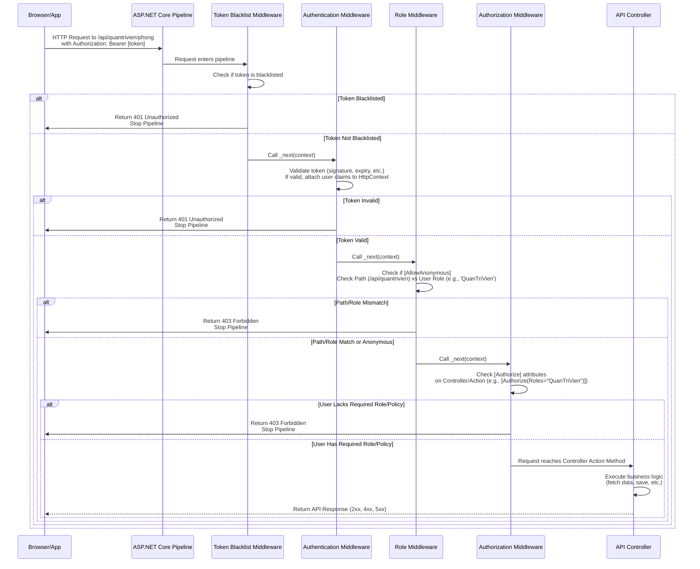

# Chapter 7: Request Middleware

Welcome back to the HotelManagementAPI tutorial!

In the previous chapters, we've explored many key pieces of our API puzzle: how data is structured ([Chapter 1: Data Transfer Objects (DTOs)](01_data_transfer_objects__dtos__.md)), how that data is checked for correctness ([Chapter 2: Validation (FluentValidation)](02_validation__fluentvalidation__.md)), where the main logic for handling requests lives ([Chapter 3: API Controllers](03_api_controllers_.md)), how we interact with the database ([Chapter 4: Database Models](04_database_models_.md) and [Chapter 5: Database Access (Dapper)](05_database_access__dapper__.md)), and crucially, how we secure our API to ensure only authorized users can access specific resources ([Chapter 6: Authentication & Authorization (JWT)](06_authentication___authorization__jwt__.md)).

But how do all these pieces connect and execute in order when a request arrives at our API? How does the system know to check for a token *before* running the controller code, or to validate data *before* saving it to the database?

This sequential processing is handled by something called **Request Middleware**.

## What is Request Middleware? The Checkpoint Analogy

Imagine a guest arriving at our hotel. They don't just walk straight to their room. They might go through a series of steps:

1.  Arrive at the entrance.
2.  Perhaps a security check or luggage scan.
3.  Go to the front desk for check-in (Authentication).
4.  Get their room key card (the Token).
5.  Use the key card to access the elevator for their floor (Authorization check).
6.  Use the key card to open their room door (Controller action).
7.  Maybe request room service (another request going through a similar process).

**Middleware** in our API is very similar to these checkpoints and services. It's a software component that sits in a **pipeline**, processing incoming requests and outgoing responses sequentially.

Think of it as a chain or a series of handlers. When an HTTP request hits our API, it enters the pipeline and passes through each configured middleware component one by one before potentially reaching the final destination, which is often an API controller action method.

Each middleware component can perform a specific task:

*   Log information about the request.
*   Handle errors.
*   Check for a valid JWT token (Authentication).
*   Check if the user has permission to access the requested path (Authorization).
*   Compress responses.
*   Serve static files (like HTML, CSS, JavaScript).
*   Route the request to the correct endpoint.

After a middleware component performs its task, it typically passes the request along to the *next* middleware in the pipeline. This continues until a middleware component decides to short-circuit the pipeline (e.g., by returning an error response like 401 Unauthorized or 403 Forbidden) or the request reaches its final handler (like a controller method).

## Why Use Middleware?

Using middleware provides several benefits:

*   **Separation of Concerns:** Each middleware has a single responsibility (e.g., authentication, logging). This keeps code clean and focused.
*   **Reusability:** Middleware components can be reused across different parts of your application or even in other projects.
*   **Control:** You have explicit control over the order in which tasks are performed on a request. The order of middleware configuration is critical.
*   **Pluggability:** You can easily add, remove, or replace middleware components in the pipeline.

## The ASP.NET Core Request Pipeline

In ASP.NET Core, the request pipeline is configured in the `Program.cs` file. The order in which you add middleware using `app.Use...()` methods is the order in which requests will flow through them.

Let's look at the relevant part of `Program.cs` again, specifically the lines *after* `var app = builder.Build();`:

```csharp
// File: Program.cs (simplified)

var app = builder.Build();

// Configure the HTTP request pipeline.
// The order here MATTERS!

// 1. Swagger UI (often first or early, especially in dev)
var enableSwagger = builder.Configuration.GetValue<bool>("Swagger:Enable");
if (enableSwagger || app.Environment.IsDevelopment())
{
    app.UseSwagger(); // Adds the Swagger middleware
    app.UseSwaggerUI(/* ... configuration ... */); // Adds the Swagger UI middleware
}

// 2. CORS Middleware (usually early)
app.UseCors("AllowAllOrigins"); // Adds CORS handling

// 3. Custom Token Blacklist Middleware (VERY early, before auth)
app.UseMiddleware<TokenBlacklistMiddleware>();

// 4. Authentication Middleware (validates who the user is)
app.UseAuthentication();

// 5. Custom Role Middleware (after auth, before attribute auth)
app.UseMiddleware<RoleMiddleware>();

// 6. Authorization Middleware (checks [Authorize] attributes/policies)
app.UseAuthorization();

// 7. Routing Middleware (matches the request path to an endpoint)
// Often implicitly added by UseEndpoints or MapControllers/MapRazorPages
// app.UseRouting(); // Could be explicit

// 8. Endpoint Middleware (executes the final handler, like a controller action)
app.MapControllers(); // Maps controller routes

// 9. HTTPS Redirection (often earlier, but placed here for diagram simplicity)
app.UseHttpsRedirection(); // Redirects HTTP requests to HTTPS

// ... other middleware like UseStaticFiles, UseExceptionHandler ...

app.Run(); // Starts the application, blocking until stopped
```

This sequence of `app.Use...()` calls defines the pipeline. A request comes in at the top and flows downwards.

## How a Custom Middleware is Written (`InvokeAsync`)

You can write your own custom middleware components. A common pattern is to create a class with a constructor that accepts a `RequestDelegate` and a public method named `InvokeAsync` (or `Invoke`) that accepts an `HttpContext`.

The `RequestDelegate` (`_next` in the examples) is a delegate that represents the *next* middleware component in the pipeline. Calling `await _next(context)` passes the request to the next step. If you *don't* call `_next`, the pipeline stops (e.g., if the middleware handles the request and writes a response itself).

Let's revisit the structure of our custom middleware classes from [Chapter 6: Authentication & Authorization (JWT)](06_authentication___authorization__jwt__.md):

### `TokenBlacklistMiddleware` Example

```csharp
// File: RoleMiddleware/RoleMiddleware.cs (Part 2 of the file)
using Microsoft.AspNetCore.Http;
using Microsoft.Extensions.Caching.Memory;
using System.Threading.Tasks;

public class TokenBlacklistMiddleware // Our custom middleware class
{
    private readonly RequestDelegate _next; // Represents the next middleware
    private readonly IMemoryCache _cache; // Dependency injected service (Chapter 8)

    // Constructor: Gets the next delegate and any services it needs
    public TokenBlacklistMiddleware(RequestDelegate next, IMemoryCache cache)
    {
        _next = next;
        _cache = cache;
    }

    // This method is called for each request
    public async Task InvokeAsync(HttpContext context)
    {
        // 1. Get the token from the request header
        var token = context.Request.Headers["Authorization"].ToString().Replace("Bearer ", "");

        // 2. Check if the token exists AND is in the blacklist cache
        if (!string.IsNullOrEmpty(token) && _cache.TryGetValue(token, out _))
        {
            // Token is blacklisted! Stop the pipeline.
            context.Response.StatusCode = StatusCodes.Status401Unauthorized; // Set status code
            await context.Response.WriteAsync("Token đã bị thu hồi. Vui lòng đăng nhập lại."); // Write response body
            return; // DO NOT call _next, the request ends here
        }

        // 3. If token is not blacklisted (or no token), proceed to the next middleware
        await _next(context);
    }
}
```

**Explanation:**

*   The constructor receives the `next` delegate automatically when the middleware is added to the pipeline in `Program.cs`. It also receives `IMemoryCache` because we registered it with Dependency Injection (`builder.Services.AddMemoryCache()` in `Program.cs`).
*   The `InvokeAsync` method is the core logic. It gets the `HttpContext` object, which contains all information about the current request and allows setting the response.
*   It checks for the token in the request headers and then checks the `_cache`.
*   If the token *is* in the cache (meaning it's blacklisted), it sets the HTTP status code to 401 Unauthorized, writes an error message to the response body, and importantly, it returns *without* calling `await _next(context)`. This stops the request from proceeding further down the pipeline.
*   If the token is *not* blacklisted, it calls `await _next(context)`, allowing the request to continue to the next middleware (which is `UseAuthentication()` in this case).

### `RoleMiddleware` Example

```csharp
// File: RoleMiddleware/RoleMiddleware.cs (Part 1 of the file)
using Microsoft.AspNetCore.Http;
using Microsoft.AspNetCore.Authorization; // Needed for AllowAnonymousAttribute
using System.Linq;
using System.Security.Claims;
using System.Threading.Tasks;

public class RoleMiddleware // Our custom middleware class
{
    private readonly RequestDelegate _next; // Represents the next middleware

    // Constructor: Gets the next delegate
    public RoleMiddleware(RequestDelegate next)
    {
        _next = next;
    }

    // This method is called for each request
    public async Task InvokeAsync(HttpContext context)
    {
        // 1. Skip if the endpoint has [AllowAnonymous] (defined via GetEndpoint())
        var endpoint = context.GetEndpoint();
        if (endpoint?.Metadata?.GetMetadata<AllowAnonymousAttribute>() != null)
        {
            await _next(context); // Just pass through immediately
            return;
        }

        // 2. Get the user's role from the claims (added by UseAuthentication)
        var userRole = context.User.Claims.FirstOrDefault(c => c.Type == "Vaitro")?.Value;

        // 3. Perform path-based role checks
        // Example: If path starts with /api/quantrivien AND user is NOT QuanTriVien
        if (context.Request.Path.StartsWithSegments("/api/quantrivien") && userRole != "QuanTriVien")
        {
            context.Response.StatusCode = StatusCodes.Status403Forbidden;
            await context.Response.WriteAsync("Bạn không có quyền truy cập vào tài nguyên này.");
            return; // Stop the pipeline
        }
        // Add more path/role checks here...
        else if (context.Request.Path.StartsWithSegments("/api/nhanvien") && userRole != "NhanVien" && userRole != "QuanTriVien")
        {
            context.Response.StatusCode = StatusCodes.Status403Forbidden;
            await context.Response.WriteAsync("Bạn không có quyền truy cập vào tài nguyên này.");
            return; // Stop the pipeline
        }
         else if (context.Request.Path.StartsWithSegments("/api/khachhang") && userRole != "KhachHang" && userRole != "NhanVien" && userRole != "QuanTriVien")
        {
            context.Response.StatusCode = StatusCodes.Status403Forbidden;
            await context.Response.WriteAsync("Bạn không có quyền truy cập vào tài nguyên này.");
            return; // Stop the pipeline
        }


        // 4. If checks pass, proceed to the next middleware (UseAuthorization, then controller)
        await _next(context);
    }
}
```

**Explanation:**

*   Similar structure to `TokenBlacklistMiddleware`, it gets the `next` delegate in the constructor.
*   It uses `context.GetEndpoint()` to check if the specific endpoint the request is targeting has the `[AllowAnonymous]` attribute. If so, it bypasses the checks and calls `_next` immediately.
*   It accesses `context.User.Claims` to get the user's role. This `context.User` object is populated by the `UseAuthentication()` middleware that ran *before* this middleware in the pipeline.
*   It performs checks based on the request path (`context.Request.Path.StartsWithSegments(...)`) and the user's `userRole`.
*   If any check fails, it sets the status code to 403 Forbidden, writes a response, and returns without calling `_next`, stopping the pipeline.
*   If all checks pass, it calls `await _next(context)`, allowing the request to continue to the next middleware (`UseAuthorization()`).

## The Request Flow Through Middleware

Let's visualize the journey of a request to a protected endpoint (`/api/quantrivien/phong`) through the relevant parts of our middleware pipeline:



This diagram clearly shows how middleware components process the request step-by-step. If any step (like token validation or authorization) fails, the pipeline is stopped, and an appropriate error response is returned immediately, preventing the request from reaching the controller.

## Standard Middleware in ASP.NET Core

Besides our custom middleware, the `Program.cs` file includes standard middleware provided by ASP.NET Core or other libraries:

*   `app.UseSwagger()` / `app.UseSwaggerUI()`: Middleware to generate and serve the OpenAPI specification (used by Swagger UI) and the Swagger UI interactive documentation itself. We saw this briefly when setting up Swagger.
*   `app.UseCors()`: Handles Cross-Origin Resource Sharing, allowing requests from different domains. Crucial for enabling a frontend application hosted separately to talk to our API.
*   `app.UseHttpsRedirection()`: Automatically redirects incoming HTTP requests to HTTPS for secure communication.
*   `app.UseRouting()`: Matches the incoming request URL to endpoints defined in the application (like controller actions).
*   `app.UseEndpoints()` or `app.MapControllers()`: Execute the matched endpoint. This is often where the pipeline branches to execute the specific code for that endpoint (like our controller action methods).

Each of these components performs a specific, necessary task in handling the request before or after our custom logic.

## Summary

In this chapter, we learned about **Request Middleware**, understanding it as a series of components forming a pipeline that processes incoming HTTP requests sequentially. Each middleware performs a specific task, such as checking for blacklisted tokens (`TokenBlacklistMiddleware`), authenticating the user (`UseAuthentication`), performing path-based role checks (`RoleMiddleware`), or enforcing `[Authorize]` attributes (`UseAuthorization`).

We saw how middleware is configured and ordered in the `Program.cs` file and how custom middleware classes are written using the `InvokeAsync` method and the `_next` delegate to control the flow. We visualized how a request travels through this pipeline, potentially being stopped early if security checks fail.

Middleware is a powerful and flexible pattern in ASP.NET Core that allows you to manage cross-cutting concerns and control the request processing flow in a clean and modular way.

With a solid understanding of the pipeline, we've almost covered the major components of the API. The last core piece is understanding how application-wide settings and services are managed and made available throughout the application.

Let's move on to [Chapter 8: Application Configuration](08_application_configuration_.md) to learn about managing settings like database connection strings, JWT secrets, and other service registrations.

Ready to see how our application gets all its necessary settings and tools? Let's go to [Chapter 8: Application Configuration](08_application_configuration_.md)!

---

<sub><sup>Generated by [AI Codebase Knowledge Builder](https://github.com/The-Pocket/Tutorial-Codebase-Knowledge).</sup></sub> <sub><sup>**References**: [[1]](https://github.com/Persinus/HotelManagementAPI/blob/36142c7f0bf93973f50c4408eb5a21a7f994eea2/Program.cs), [[2]](https://github.com/Persinus/HotelManagementAPI/blob/36142c7f0bf93973f50c4408eb5a21a7f994eea2/RoleMiddleware/RoleMiddleware.cs)</sup></sub>