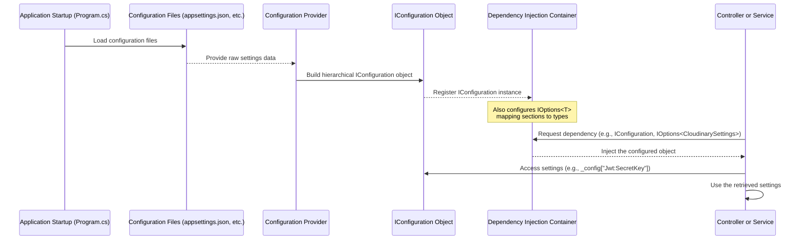

# Chapter 8: Application Configuration

Welcome back to the HotelManagementAPI tutorial!

In the last chapter, [Chapter 7: Request Middleware](07_request_middleware_.md), we learned how incoming requests are processed step-by-step through a pipeline of middleware components, each performing a specific task before potentially reaching our controllers.

Throughout the previous chapters, we've seen references to various settings:
*   The database connection string in [Chapter 5: Database Access (Dapper)](05_database_access__dapper__.md).
*   The secret key and issuer/audience for JWT in [Chapter 6: Authentication & Authorization (JWT)](06_authentication___authorization__jwt__.md).
*   Configuration for external services like Cloudinary or VNPAY payments.

Where do these settings come from? How does our application know which database to connect to or what secret key to use? This information isn't hardcoded directly into our controllers or services because it often needs to change depending on where the application is running (e.g., your development machine vs. the live server).

This is where **Application Configuration** comes in.

## What is Application Configuration?

Think of Application Configuration as the **master instruction manual** or **settings panel** for our entire API. It contains all the external details and knobs our application needs to function correctly in a specific environment.

It stores crucial information like:
*   Database connection details (address, username, password).
*   API keys or secrets for talking to other services (like payment gateways, cloud storage).
*   Settings for how features should behave (e.g., JWT token lifetime, logging levels).
*   Paths to external resources (like machine learning model files).

The key benefits of using a dedicated configuration system are:
1.  **Flexibility:** You can easily change settings for different environments (development, testing, production) without changing the code itself.
2.  **Security:** Sensitive information (like passwords or API secrets) can be managed outside the source code, potentially using more secure methods like environment variables in production.
3.  **Organization:** It centralizes all external settings in one place, making the application easier to manage.

In ASP.NET Core, the configuration system is powerful and can read settings from various sources, including files (`appsettings.json`, `appsettings.Development.json`), environment variables, command-line arguments, and even custom sources. The project is set up to use `appsettings.json` and `appsettings.Development.json`.

## Where Settings Are Stored: `appsettings.json`

The primary place for configuration in our project is the `appsettings.json` file at the root of the project. This file uses the JSON format to store settings in a structured way.

Let's look at a simplified version of the `appsettings.json` file:

```json
// File: appsettings.json (simplified)
{
    // Path to sentiment model file (example of a custom setting)
    "SentimentModelPath": "TrainMl/sentimentModel.zip",

    // Logging configuration
    "Logging": {
        "LogLevel": {
            "Default": "Information",
            "Microsoft.AspNetCore": "Warning"
        }
    },

    // Settings for the VNPAY payment gateway
    "Vnpay": {
        "TmnCode": "...", // Terminal Code
        "HashSecret": "...", // Secret key for hashing
        "BaseUrl": "...",   // URL for VNPAY API
        "ReturnUrl": "..."  // Callback URL after payment
    },

    // JWT Authentication settings
    "Jwt": {
        "SecretKey": "your_super_secret_key_1234567890", // IMPORTANT: Change this & keep secret!
        "Issuer": "your-issuer",     // Who issued the token
        "Audience": "your-audience" // Who the token is for
    },

    // Swagger UI settings
    "Swagger": {
        "Enable": true // Enable/disable Swagger UI
    },

    // Database Connection String
    "ConnectionStrings": {
        "DefaultConnection": "Server=...;Database=...;User Id=...;Password=...;TrustServerCertificate=True;" // Your database connection string
    },

    // Cloudinary settings (for image uploads)
    "CloudinarySettings": {
      "CloudName": "...",
      "ApiKey": "...",
      "ApiSecret": "..."
    },

    // Allowed hosts for the web server
    "AllowedHosts": "*"
}
```

This file structures settings into logical sections (`Logging`, `Vnpay`, `Jwt`, `ConnectionStrings`, etc.). Each section contains key-value pairs or further nested sections.

### Environment-Specific Settings (`appsettings.Development.json`)

You'll also find an `appsettings.Development.json` file.

```json
// File: appsettings.Development.json
{
  "Logging": {
    "LogLevel": {
      "Default": "Information",
      "Microsoft.AspNetCore": "Warning"
    }
  }
}
```

This file is specifically for settings that apply *only* when the application is running in the "Development" environment. ASP.NET Core automatically loads this file and *overrides* any matching settings from `appsettings.json`. For example, the `LogLevel` settings here override the ones in `appsettings.json` when running in Development mode.

This allows you to have different settings for development (e.g., more detailed logging) and production (e.g., a different database server or stricter security keys). You can create `appsettings.Production.json` or `appsettings.Staging.json` as needed.

## Accessing Configuration: `IConfiguration`

How does our application code actually read these settings? ASP.NET Core provides an interface called `IConfiguration` which represents the application's configuration.

You can access `IConfiguration` anywhere in your application where Dependency Injection is used (like controllers or services) by simply requesting it in the constructor.

Let's see how the `TatCaTruyCapController` gets JWT settings:

```csharp
// Inside TatCaTruyCapController.cs (simplified)
using Microsoft.Extensions.Configuration; // Needed for IConfiguration

public class TatCaTruyCapController : ControllerBase
{
    private readonly IConfiguration _config; // Declare a field to hold the configuration

    // Constructor: Ask for IConfiguration and other services
    public TatCaTruaCapController(
        IDbConnection db, // Database connection from Chapter 5
        IOptions<CloudinarySettings> cloudinaryOptions, // Configuration as object (more below)
        IConfiguration config) // *** Here we inject IConfiguration ***
    {
        _db = db;
        _config = config; // Store the provided IConfiguration
        // ... setup for Cloudinary using cloudinaryOptions ...
    }

    // ... other methods ...

    [HttpPost("dangnhap")]
    public async Task<ActionResult<string>> DangNhap([FromBody] LoginDTO login)
    {
        // ... database lookup and password verification ...

        // Access settings using _config
        var secretKey = _config["Jwt:SecretKey"];   // Get value by section:key
        var issuer = _config["Jwt:Issuer"];         // Get value by section:key
        var audience = _config.GetValue<string>("Jwt:Audience"); // Another way to get value, specifying type

        // ... use settings to generate JWT token (Chapter 6) ...
        var token = JwtHelper.GenerateJwtToken(/* ... */, secretKey, issuer, audience);

        return Ok(new { Token = token });
    }

    // ... rest of the controller ...
}
```

In this example:
*   `private readonly IConfiguration _config;` declares a field to hold the configuration object.
*   The constructor `public TatCaTruaCapController(... , IConfiguration config)` receives the configured `IConfiguration` object via Dependency Injection.
*   Inside the `DangNhap` method, we access specific settings using the indexer `_config["SectionName:KeyName"]` (e.g., `_config["Jwt:SecretKey"]`) or the `GetValue<T>()` method (`_config.GetValue<string>("Jwt:Audience")`).

This pattern allows any part of the application that needs settings to easily obtain them without knowing exactly where they came from.

## Accessing Configuration as Objects: `IOptions<T>`

While accessing settings using string keys like `_config["Jwt:SecretKey"]` works, it can become cumbersome for larger configuration sections, and you lose the benefits of compiler checks (e.g., a typo in the string key won't be caught until runtime).

A cleaner approach, especially for related settings, is to map a configuration section to a dedicated C# class and inject that class using `IOptions<T>`.

Let's look at the `CloudinarySettings` example. First, we have a simple class that mirrors the structure of the `"CloudinarySettings"` section in `appsettings.json`:

```csharp
// File: Data/Cloudinary.cs (simplified)
public class CloudinarySettings // This class matches the "CloudinarySettings" section structure
{
    public string CloudName { get; set; } // Maps to "CloudName" in appsettings
    public string ApiKey { get; set; }    // Maps to "ApiKey"
    public string ApiSecret { get; set; } // Maps to "ApiSecret"
}
```

Next, in `Program.cs`, we tell ASP.NET Core to read the `"CloudinarySettings"` section from the configuration and bind it to our `CloudinarySettings` class.

```csharp
// File: Program.cs (simplified)
// ... code before builder.Build() ...

// Cấu hình Cloudinary (Configure Cloudinary)
// Tell the app to read the "CloudinarySettings" section and fill a CloudinarySettings object
builder.Services.Configure<CloudinarySettings>(
    builder.Configuration.GetSection("CloudinarySettings"));

// ... rest of setup ...
```

`builder.Services.Configure<CloudinarySettings>(...)` registers the necessary services so that when someone requests `IOptions<CloudinarySettings>`, the framework knows to provide an instance of `CloudinarySettings` populated with values from the "CloudinarySettings" section of the configuration.

Now, in a controller or service that needs the Cloudinary settings, you inject `IOptions<CloudinarySettings>`:

```csharp
// Inside TatCaTruyCapController.cs (simplified)
using Microsoft.Extensions.Options; // Needed for IOptions

public class TatCaTruyCapController : ControllerBase
{
    private readonly Cloudinary _cloudinary; // Service that uses the settings

    // Constructor: Ask for IOptions<CloudinarySettings>
    public TatCaTruyCapController(
        IDbConnection db,
        IOptions<CloudinarySettings> cloudinaryOptions, // *** Here we inject IOptions ***
        IConfiguration config)
    {
        // Access the settings object via the .Value property of IOptions<T>
        var settings = cloudinaryOptions.Value;

        // Use the settings object to configure the Cloudinary service
        var account = new Account(
            settings.CloudName, // Access using the class property name
            settings.ApiKey,
            settings.ApiSecret
        );
        _cloudinary = new Cloudinary(account);
        // ... other initializations ...
    }

    // ... methods using _cloudinary ...
}
```

This approach:
*   Provides compile-time checking for property names.
*   Makes the configuration object (`settings`) easier to work with directly.
*   `IOptions<T>` itself provides additional features like change tracking (though the basic usage is just accessing `.Value`).

The project uses `IConfiguration` directly for simpler, individual values (like `Jwt:SecretKey`, `Swagger:Enable`) and `IOptions<T>` for structured sections like `CloudinarySettings` and `Vnpay`. You can see the `VnpayService` also uses `IConfiguration.GetSection` to read its settings.

```csharp
// Inside Services/VnpayService.cs (simplified)
using Microsoft.Extensions.Configuration;

public class VnpayService : IVnpayService
{
    private readonly IConfiguration _configuration; // Inject IConfiguration

    public VnpayService(IConfiguration configuration) // Constructor injects IConfiguration
    {
        _configuration = configuration;
    }

    public string CreatePaymentUrl(PaymentRequest request)
    {
        // Get the Vnpay section and then access keys within it
        var vnpayConfig = _configuration.GetSection("Vnpay");
        var tmnCode = vnpayConfig["TmnCode"];
        var hashSecret = vnpayConfig["HashSecret"];
        var baseUrl = vnpayConfig["BaseUrl"];
        var returnUrl = vnpayConfig["ReturnUrl"];

        // ... use the settings to build the payment URL ...
        return $"{baseUrl}?{/* ... */}";
    }
    // ... other methods ...
}
```
This shows another valid way to access a section using `IConfiguration.GetSection("SectionName")`.

## How Configuration Works (Simplified Flow)

Here's a simplified view of how configuration is loaded and used:



When the application starts (`Program.cs`), it automatically loads settings from standard sources like `appsettings.json`. These are processed by configuration providers which build the final `IConfiguration` object available via Dependency Injection. When your code needs a setting, it asks the DI container for the `IConfiguration` or `IOptions<T>` instance, and the framework provides it.

## Configuration in `Program.cs`

The `Program.cs` file is also where configuration is used to set up various services and middleware:

*   `builder.Configuration.GetConnectionString("DefaultConnection")`: Reads the database connection string to configure the `IDbConnection` service for Dapper ([Chapter 5](05_database_access__dapper__.md)).
*   `builder.Configuration["SentimentModelPath"]`: Reads the path for the sentiment model file to register a `SentimentModelConfig` object.
*   `builder.Services.AddAuthentication(...).AddJwtBearer(options => { ... options.TokenValidationParameters.IssuerSigningKey = new SymmetricSecurityKey(Encoding.UTF8.GetBytes(builder.Configuration["Jwt:SecretKey"])); ... });`: Reads the JWT secret key and other settings to configure the Authentication middleware ([Chapter 6](06_authentication___authorization__jwt__.md)).
*   `var enableSwagger = builder.Configuration.GetValue<bool>("Swagger:Enable"); if (enableSwagger || ... ) { app.UseSwagger(); app.UseSwaggerUI(); }`: Reads the "Swagger:Enable" setting to conditionally enable the Swagger middleware ([Chapter 7](07_request_middleware_.md)).

This shows how the settings defined in `appsettings.json` flow into the application's startup logic to configure essential services and behaviors.

## Summary

In this final concept chapter, we explored **Application Configuration**. We learned that it's the system used to manage external settings like database connection strings, API keys, and feature flags, allowing them to be easily changed without modifying the core code.

We saw that settings are primarily stored in `appsettings.json` (and environment-specific files like `appsettings.Development.json`), which provide a structured way to organize these values. We then learned two main ways our code accesses these settings: by injecting `IConfiguration` and using string keys (`_config["Section:Key"]`), or by mapping configuration sections to C# classes and injecting `IOptions<T>` for a more strongly-typed approach.

Understanding Application Configuration is crucial for deploying and managing the `HotelManagementAPI` in different environments and keeping sensitive information separate from the source code.

This chapter concludes our detailed look at the core concepts behind the `HotelManagementAPI` project. We've journeyed from understanding how data is shaped (DTOs, Models), how requests are processed step-by-step (Middleware), how the logic lives (Controllers), how we talk to the database (Dapper), how we secure the API (Auth/Authz with JWT), and finally, how the entire application gets its necessary external settings (Configuration).

You now have a solid foundation for understanding how the different pieces of this ASP.NET Core Web API project fit together.

Thank you for following this tutorial! Good luck exploring and building upon the `HotelManagementAPI` project!

---

<sub><sup>Generated by [AI Codebase Knowledge Builder](https://github.com/The-Pocket/Tutorial-Codebase-Knowledge).</sup></sub> <sub><sup>**References**: [[1]](https://github.com/Persinus/HotelManagementAPI/blob/36142c7f0bf93973f50c4408eb5a21a7f994eea2/Controllers/CloudinanyController.cs), [[2]](https://github.com/Persinus/HotelManagementAPI/blob/36142c7f0bf93973f50c4408eb5a21a7f994eea2/Controllers/TatCaTruyCapController.cs), [[3]](https://github.com/Persinus/HotelManagementAPI/blob/36142c7f0bf93973f50c4408eb5a21a7f994eea2/Data/Cloudinary.cs), [[4]](https://github.com/Persinus/HotelManagementAPI/blob/36142c7f0bf93973f50c4408eb5a21a7f994eea2/Program.cs), [[5]](https://github.com/Persinus/HotelManagementAPI/blob/36142c7f0bf93973f50c4408eb5a21a7f994eea2/Services/VnpayService.cs), [[6]](https://github.com/Persinus/HotelManagementAPI/blob/36142c7f0bf93973f50c4408eb5a21a7f994eea2/appsettings.Development.json), [[7]](https://github.com/Persinus/HotelManagementAPI/blob/36142c7f0bf93973f50c4408eb5a21a7f994eea2/appsettings.json)</sup></sub>