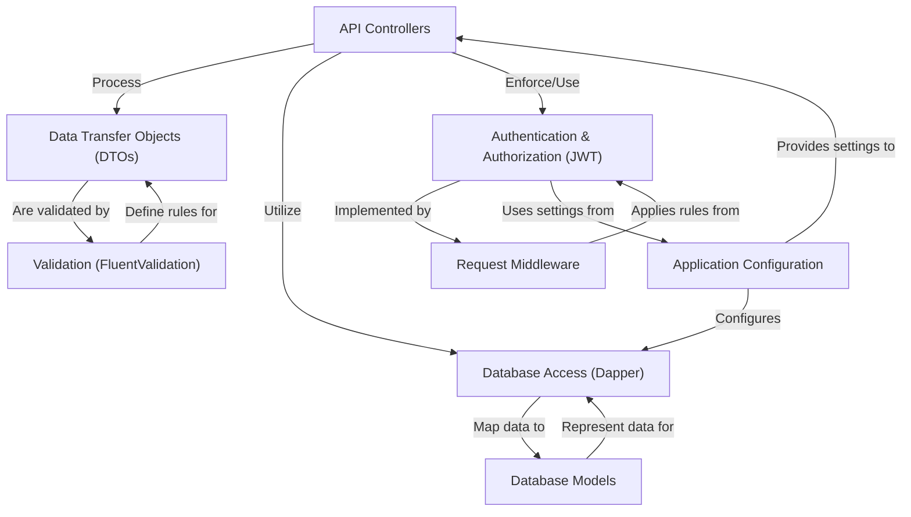

# Tutorial: HotelManagementAPI

This project is a **Hotel Management API** built using ASP.NET Core.
It acts as the backend system for a hotel, allowing various users (**guests, staff, administrators**) to interact with hotel operations.
Key functions include **managing rooms and services**, handling **user authentication and authorization**, facilitating **room booking and payments**, and providing features for **reporting and feedback**.

## Visual Overview

## Chapters

1. [Data Transfer Objects (DTOs)
](01_data_transfer_objects__dtos__.md)
2. [Validation (FluentValidation)
](02_validation__fluentvalidation__.md)
3. [API Controllers
](03_api_controllers_.md)
4. [Database Models
](04_database_models_.md)
5. [Database Access (Dapper)
](05_database_access__dapper__.md)
6. [Authentication & Authorization (JWT)
](06_authentication___authorization__jwt__.md)
7. [Request Middleware
](07_request_middleware_.md)
8. [Application Configuration
](08_application_configuration_.md)

---

Generated by [AI Codebase Knowledge Builder](https://github.com/The-Pocket/Tutorial-Codebase-Knowledge).
